# 🔢 Đồ án cá nhân: 8-Puzzle Solver

## 🎯 Mục tiêu
Xây dựng một chương trình giải bài toán **8-Puzzle** sử dụng nhiều thuật toán tìm kiếm khác nhau trong lĩnh vực Trí tuệ nhân tạo.

---

## 🧠 Các thuật toán được triển khai
## Uninformed search algorithms
---
### 1. **Khái niệm chung về Uninformed Search Algorithms**
- **Uninformed Search** (tìm kiếm mù) là các thuật toán tìm kiếm không sử dụng thông tin heuristic (thông tin bổ sung về chi phí ước lượng đến mục tiêu). Chúng dựa vào cấu trúc của không gian tìm kiếm và các quy tắc cố định để khám phá các trạng thái.
- **Các thành phần chính**:
  - **Không gian trạng thái (State Space)**: Tập hợp tất cả các trạng thái có thể có của bài toán.
  - **Trạng thái ban đầu (Initial State)**: Điểm bắt đầu của bài toán.
  - **Trạng thái mục tiêu (Goal State)**: Trạng thái cần đạt được.
  - **Hành động (Actions)**: Các thao tác có thể thực hiện để chuyển từ trạng thái này sang trạng thái khác.
  - **Chi phí đường đi (Path Cost)**: Chi phí liên quan đến mỗi hành động hoặc đường đi (nếu có).
  - **Cấu trúc dữ liệu**: Thường sử dụng hàng đợi (queue), ngăn xếp (stack) hoặc hàng đợi ưu tiên (priority queue) để quản lý các trạng thái cần khám phá.
---
### 2. **Các thuật toán Uninformed Search**

#### a. **Breadth-First Search (BFS - Tìm kiếm theo chiều rộng)**
- **Mô tả**: Khám phá tất cả các trạng thái ở độ sâu hiện tại trước khi chuyển sang độ sâu tiếp theo. Sử dụng **hàng đợi (queue)** để lưu trữ các trạng thái.
- **Cách hoạt động**:
  1. Bắt đầu từ trạng thái ban đầu, thêm vào hàng đợi.
  2. Lấy trạng thái đầu tiên trong hàng đợi, kiểm tra xem có phải trạng thái mục tiêu không.
  3. Nếu không, sinh tất cả các trạng thái con (successors) và thêm chúng vào cuối hàng đợi.
  4. Lặp lại cho đến khi tìm thấy mục tiêu hoặc hàng đợi rỗng.
- **Đặc điểm**:
  - **Hoàn chỉnh (Complete)**: Tìm được giải pháp nếu tồn tại, với không gian trạng thái hữu hạn.
  - **Tối ưu (Optimal)**: Tìm đường đi ngắn nhất nếu chi phí hành động đồng nhất.
  - **Độ phức tạp**:
    - Thời gian: O(b^d), với b là số nhánh trung bình, d là độ sâu của giải pháp.
    - Không gian: O(b^d), do lưu trữ nhiều trạng thái ở mỗi mức.
- **Ứng dụng**: Tìm đường đi ngắn nhất trong đồ thị không trọng số, như mê cung.

#### b. **Depth-First Search (DFS - Tìm kiếm theo chiều sâu)**
- **Mô tả**: Khám phá trạng thái theo chiều sâu tối đa trước khi quay lại (backtrack). Sử dụng **ngăn xếp (stack)** hoặc đệ quy.
- **Cách hoạt động**:
  1. Bắt đầu từ trạng thái ban đầu, khám phá trạng thái con đầu tiên.
  2. Tiếp tục đi sâu vào một nhánh cho đến khi gặp ngõ cụt hoặc tìm thấy mục tiêu.
  3. Quay lại (backtrack) để khám phá các nhánh khác.
- **Đặc điểm**:
  - **Hoàn chỉnh**: Không đảm bảo trong không gian vô hạn hoặc có chu kỳ, trừ khi có cơ chế kiểm tra chu kỳ.
  - **Tối ưu**: Không tối ưu, vì có thể tìm đường đi dài hơn.
  - **Độ phức tạp**:
    - Thời gian: O(b^m), với m là độ sâu tối đa của không gian trạng thái.
    - Không gian: O(bm), do chỉ lưu một đường đi tại một thời điểm.
- **Ứng dụng**: Tìm kiếm trong không gian lớn, như giải câu đố, khi không cần đường đi tối ưu.

#### c. **Uniform Cost Search (UCS - Tìm kiếm chi phí đồng nhất)**
- **Mô tả**: Khám phá trạng thái theo chi phí đường đi tăng dần. Sử dụng **hàng đợi ưu tiên (priority queue)** dựa trên chi phí.
- **Cách hoạt động**:
  1. Bắt đầu từ trạng thái ban đầu, thêm vào hàng đợi ưu tiên với chi phí 0.
  2. Lấy trạng thái có chi phí thấp nhất từ hàng đợi, kiểm tra xem có phải mục tiêu không.
  3. Sinh các trạng thái con, tính chi phí đường đi từ gốc, thêm vào hàng đợi theo thứ tự chi phí.
  4. Lặp lại cho đến khi tìm thấy mục tiêu hoặc hàng đợi rỗng.
- **Đặc điểm**:
  - **Hoàn chỉnh**: Nếu chi phí hành động lớn hơn 0.
  - **Tối ưu**: Tìm đường đi có chi phí thấp nhất.
  - **Độ phức tạp**:
    - Thời gian: O(b^(C*/ε)), với C* là chi phí tối ưu, ε là chi phí hành động nhỏ nhất.
    - Không gian: O(b^(C*/ε)).
- **Ứng dụng**: Tìm đường đi tối ưu trong đồ thị có trọng số, như định tuyến đường đi.

#### d. **Iterative Deepening Search (IDS - Tìm kiếm sâu dần)**
- **Mô tả**: Kết hợp ưu điểm của BFS và DFS, thực hiện DFS với giới hạn độ sâu tăng dần.
- **Cách hoạt động**:
  1. Thực hiện DFS với giới hạn độ sâu (depth limit) là 0.
  2. Nếu không tìm thấy mục tiêu, tăng giới hạn độ sâu lên 1 và lặp lại.
  3. Tiếp tục tăng giới hạn độ sâu cho đến khi tìm thấy mục tiêu.
- **Đặc điểm**:
  - **Hoàn chỉnh**: Nếu không gian trạng thái hữu hạn.
  - **Tối ưu**: Tìm đường đi ngắn nhất nếu chi phí hành động đồng nhất.
  - **Độ phức tạp**:
    - Thời gian: O(b^d), tương tự BFS nhưng lặp lại nhiều lần.
    - Không gian: O(bd), tương tự DFS.
- **Ứng dụng**: Khi cần kết hợp ưu điểm của BFS (tối ưu) và DFS (tiết kiệm bộ nhớ).
---
### 3. **So sánh tổng quát**
| Thuật toán | Hoàn chỉnh | Tối ưu | Độ phức tạp thời gian | Độ phức tạp không gian | Ứng dụng chính |
|------------|------------|--------|-----------------------|------------------------|----------------|
| **BFS**    | Có (nếu hữu hạn) | Có (nếu chi phí đồng nhất) | O(b^d) | O(b^d) | Đường đi ngắn nhất (không trọng số) |
| **DFS**    | Không (nếu có chu kỳ) | Không | O(b^m) | O(bm) | Không gian lớn, không cần tối ưu |
| **UCS**    | Có (nếu chi phí > 0) | Có | O(b^(C*/ε)) | O(b^(C*/ε)) | Đường đi tối ưu (có trọng số) |
| **IDS**    | Có (nếu hữu hạn) | Có (nếu chi phí đồng nhất) | O(b^d) | O(bd) | Kết hợp BFS và DFS |
---
### 4. **Giải pháp tổng quát của Uninformed Search**
- **Quy trình chung**:
  1. Xác định trạng thái ban đầu và mục tiêu.
  2. Xây dựng không gian trạng thái và các hành động có thể thực hiện.
  3. Sử dụng cấu trúc dữ liệu (queue, stack, priority queue) để quản lý các trạng thái cần khám phá.
  4. Áp dụng chiến lược chọn trạng thái (theo chiều rộng, chiều sâu, chi phí, hoặc sâu dần) để tìm đường đi từ trạng thái ban đầu đến mục tiêu.
- **Ưu điểm**: Đơn giản, không cần thông tin bổ sung (heuristic), phù hợp với các bài toán không có thông tin về chi phí ước lượng.
- **Nhược điểm**: Hiệu quả thấp trong không gian trạng thái lớn hoặc phức tạp, đặc biệt khi không có heuristic hỗ trợ.

### 📷 **Hình ảnh các thuật toán được áp dụng trong trò chơi**
| **Thuật Toán**                  | **Minh Họa GIF**                                  |
|----------------------------------|---------------------------------------------------|
| **Breadth-First Search (BFS)**  | 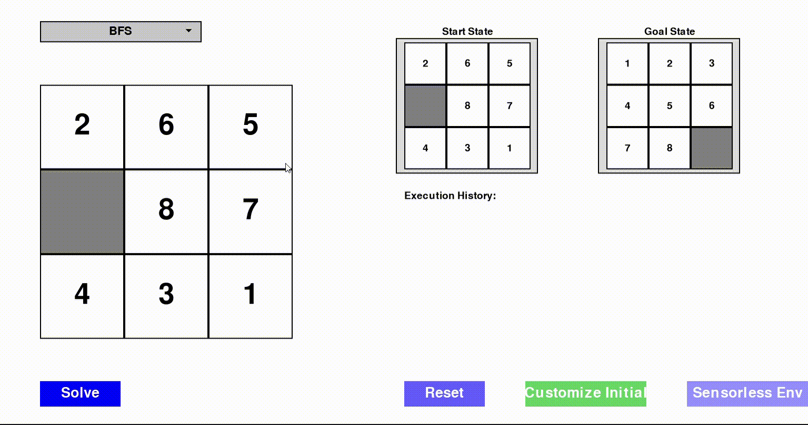  |
| **Depth-First Search (DFS)**    |                |
| **Uniform Cost Search (UCS)**   | 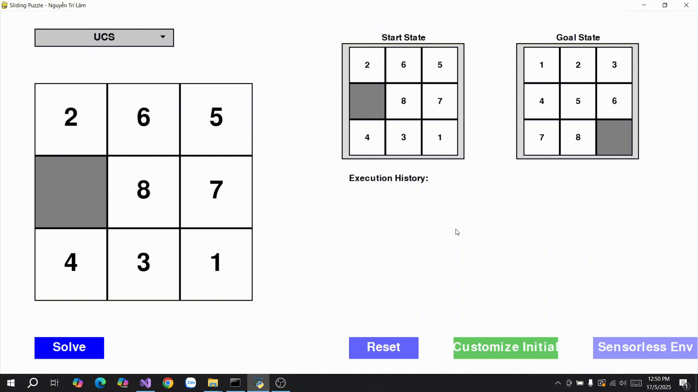               |
| **Iterative Deepening Search (IDS)** | 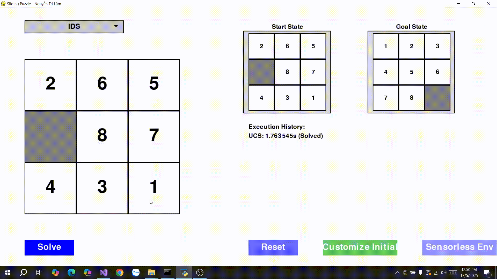         |

### 🔍 So sánh các thuật toán tìm kiếm không thông tin (Uninformed Search Algorithms)

| **Thuật toán** | **Hoàn chỉnh** | **Tối ưu** | **Bộ nhớ**       | **Thời gian**     | **Phù hợp với 8-puzzle**                                   |
|----------------|----------------|------------|------------------|-------------------|-------------------------------------------------------------|
| **BFS**        | Có             | Có         | Cao `O(b^d)`     | Cao `O(b^d)`      | ✔ Phù hợp nếu lời giải nông, nhưng tiêu tốn nhiều bộ nhớ    |
| **DFS**        | Không          | Không      | Thấp `O(bm)`     | Biến động `O(b^m)`| ❌ Không phù hợp, dễ bị kẹt và không tối ưu                 |
| **UCS**        | Có             | Có         | Cao `O(b^d)`     | Cao `O(b^d)`      | ✔ Tìm giải pháp tối ưu, nhưng tốn tài nguyên               |
| **IDS**        | Có             | Có         | Thấp `O(bd)`     | Cao `O(b^d)`      | ✔ Thích hợp khi bộ nhớ hạn chế, nhưng chậm hơn BFS          |

**Chú thích:**
- `b`: số nhánh trung bình (branching factor)
- `d`: độ sâu của lời giải tối ưu
- `m`: độ sâu tối đa của cây tìm kiếm
---
### 📝 Nhận xét chung:

Các thuật toán tìm kiếm không thông tin (Uninformed Search) đều không có kiến thức cụ thể về vị trí đích, do đó phải **duyệt toàn bộ không gian trạng thái một cách mù mờ**. Mỗi thuật toán có đặc điểm riêng:

* **BFS** thích hợp khi lời giải nằm ở độ sâu nhỏ, đảm bảo tìm được lời giải ngắn nhất nhưng **tốn nhiều bộ nhớ**.
* **DFS** có ưu điểm tiết kiệm bộ nhớ, nhưng **dễ rơi vào vòng lặp vô tận** và không đảm bảo tối ưu.
* **UCS** mở rộng BFS bằng cách tính đến chi phí, cho phép tìm lời giải tối ưu khi chi phí không đồng đều, nhưng **hiệu năng giảm nếu không gian tìm kiếm lớn**.
* **IDS** kết hợp ưu điểm của BFS và DFS: đảm bảo tối ưu, tiết kiệm bộ nhớ, nhưng **thời gian chạy lâu hơn do phải lặp lại nhiều lần**.

Với bài toán như **8-puzzle**, nơi không gian trạng thái lớn và cần lời giải tối ưu, **BFS, UCS hoặc IDS** là lựa chọn phù hợp. Tuy nhiên, khi bộ nhớ hạn chế, **IDS** thường là phương án an toàn hơn.
---
## Informed Search Algorithms
---
### 1. **Khái niệm chung về Informed Search Algorithms**
- **Informed Search** (tìm kiếm có thông tin) sử dụng **hàm heuristic** để ước lượng chi phí từ trạng thái hiện tại đến trạng thái mục tiêu, giúp định hướng tìm kiếm hiệu quả hơn so với Uninformed Search (BFS, DFS, UCS, IDS).
- **Các thành phần chính**:
  - **Không gian trạng thái (State Space)**: Tập hợp tất cả các trạng thái có thể có của bài toán (ví dụ: các hoán vị của ô trong 8-puzzle).
  - **Trạng thái ban đầu (Initial State)**: Điểm xuất phát của bài toán.
  - **Trạng thái mục tiêu (Goal State)**: Trạng thái cần đạt được.
  - **Hành động (Actions)**: Các thao tác hợp lệ để chuyển đổi giữa các trạng thái (ví dụ: di chuyển ô trống lên, xuống, trái, phải).
  - **Chi phí đường đi (Path Cost, g(n))**: Tổng chi phí từ trạng thái ban đầu đến trạng thái hiện tại (thường là số bước hoặc chi phí cụ thể của hành động).
  - **Hàm heuristic (h(n))**: Hàm ước lượng chi phí từ trạng thái hiện tại đến mục tiêu. Hàm này phải **admissible** (không overestimated) và lý tưởng là **consistent** (đáp ứng bất đẳng thức tam giác) để đảm bảo tính tối ưu.
  - **Cấu trúc dữ liệu**: Thường sử dụng hàng đợi ưu tiên (priority queue) để ưu tiên trạng thái có chi phí thấp nhất hoặc giá trị heuristic nhỏ nhất.
---
### 2. **Các thuật toán Informed Search**

#### a. **A* Search**
- **Mô tả**: A* sử dụng hàm đánh giá **f(n) = g(n) + h(n)**:
  - **g(n)**: Chi phí thực tế từ trạng thái ban đầu đến trạng thái hiện tại.
  - **h(n)**: Chi phí ước lượng từ trạng thái hiện tại đến mục tiêu (ví dụ: khoảng cách Manhattan trong 8-puzzle).
  - A* ưu tiên khám phá trạng thái có **f(n)** nhỏ nhất, đảm bảo đường đi tối ưu nếu heuristic là admissible.
- **Cách hoạt động**:
  1. Bắt đầu từ trạng thái ban đầu, thêm vào hàng đợi ưu tiên với chi phí `f(n) = g(n) + h(n)`.
  2. Lấy trạng thái có `f(n)` nhỏ nhất từ hàng đợi, kiểm tra xem có phải trạng thái mục tiêu không.
  3. Sinh các trạng thái con, tính `g(n)` và `h(n)` cho mỗi trạng thái, thêm vào hàng đợi.
  4. Lặp lại cho đến khi tìm thấy mục tiêu hoặc hàng đợi rỗng.
- **Đặc điểm**:
  - **Hoàn chỉnh**: Có, nếu không gian trạng thái hữu hạn và chi phí hành động lớn hơn 0.
  - **Tối ưu**: Có, nếu heuristic là admissible (h(n) ≤ chi phí thực tế đến mục tiêu).
  - **Độ phức tạp**:
    - Thời gian: O(b^d), nhưng thường nhanh hơn BFS/UCS nhờ heuristic định hướng.
    - Không gian: O(b^d), do lưu trữ nhiều trạng thái trong hàng đợi ưu tiên.
- **Ứng dụng**: Tìm đường đi tối ưu trong các bài toán như 8-puzzle, định tuyến, hoặc lập kế hoạch, khi cần đảm bảo chi phí thấp nhất.

#### b. **Iterative Deepening A* (IDA*)**
- **Mô tả**: IDA* kết hợp ý tưởng của A* và Iterative Deepening Search (IDS). Nó sử dụng hàm `f(n) = g(n) + h(n)` nhưng giới hạn tìm kiếm theo ngưỡng `f(n)` tăng dần, thực hiện tìm kiếm theo chiều sâu (DFS) trong mỗi lần lặp.
- **Cách hoạt động**:
  1. Bắt đầu với ngưỡng ban đầu là `f(n) = h(n)` của trạng thái ban đầu.
  2. Thực hiện DFS, chỉ khám phá các trạng thái có `f(n)` ≤ ngưỡng.
  3. Nếu không tìm thấy mục tiêu, tăng ngưỡng lên giá trị `f(n)` nhỏ nhất vượt ngưỡng hiện tại, lặp lại.
  4. Tiếp tục cho đến khi tìm thấy mục tiêu hoặc không còn trạng thái để khám phá.
- **Đặc điểm**:
  - **Hoàn chỉnh**: Có, nếu không gian trạng thái hữu hạn.
  - **Tối ưu**: Có, nếu heuristic là admissible.
  - **Độ phức tạp**:
    - Thời gian: O(b^d), nhưng có thể chậm hơn A* do lặp lại nhiều lần.
    - Không gian: O(bd), tiết kiệm bộ nhớ hơn A* vì chỉ lưu một đường đi tại mỗi lần lặp.
- **Ứng dụng**: Phù hợp cho các bài toán như 8-puzzle khi bộ nhớ hạn chế, nhưng cần giải pháp tối ưu.

#### c. **Greedy Best-First Search (Greedy)**
- **Mô tả**: Greedy ưu tiên khám phá trạng thái có giá trị **heuristic h(n)** nhỏ nhất, bỏ qua chi phí đường đi `g(n)`. Nó tập trung vào việc tiến gần trạng thái mục tiêu nhanh nhất có thể.
- **Cách hoạt động**:
  1. Bắt đầu từ trạng thái ban đầu, thêm vào hàng đợi ưu tiên với giá trị `h(n)`.
  2. Lấy trạng thái có `h(n)` nhỏ nhất, kiểm tra xem có phải mục tiêu không.
  3. Sinh các trạng thái con, tính `h(n)` cho mỗi trạng thái, thêm vào hàng đợi.
  4. Lặp lại cho đến khi tìm thấy mục tiêu hoặc hàng đợi rỗng.
- **Đặc điểm**:
  - **Hoàn chỉnh**: Không, có thể bị kẹt trong các vòng lặp hoặc bỏ sót giải pháp.
  - **Tối ưu**: Không, vì không xem xét chi phí đường đi `g(n)`, có thể dẫn đến đường đi dài hơn.
  - **Độ phức tạp**:
    - Thời gian: O(b^m), với m là độ sâu tối đa, nhưng thường nhanh hơn A* do chỉ dựa vào `h(n)`.
    - Không gian: O(b^m), tùy thuộc vào số trạng thái được lưu trữ.
- **Ứng dụng**: Dùng khi cần tìm giải pháp nhanh, không yêu cầu tối ưu, như trong một số bài toán tìm kiếm đơn giản hoặc khi thời gian thực thi là ưu tiên.

---

### 3. **So sánh tổng quát**
| Thuật toán | Hoàn chỉnh | Tối ưu | Độ phức tạp thời gian | Độ phức tạp không gian | Ứng dụng chính |
|------------|------------|--------|-----------------------|------------------------|----------------|
| **A***     | Có         | Có     | O(b^d)               | O(b^d)                | Tìm đường đi tối ưu (8-puzzle, định tuyến) |
| **IDA***   | Có         | Có     | O(b^d)               | O(bd)                 | Tìm đường đi tối ưu, tiết kiệm bộ nhớ |
| **Greedy** | Không      | Không  | O(b^m)               | O(b^m)                | Tìm giải pháp nhanh, không cần tối ưu |

---

### 4. **Giải pháp tổng quát của Informed Search**
- **Quy trình chung**:
  1. Xác định trạng thái ban đầu, trạng thái mục tiêu, và các hành động có thể thực hiện.
  2. Xây dựng hàm heuristic (ví dụ: khoảng cách Manhattan cho 8-puzzle) để ước lượng chi phí.
  3. Sử dụng hàng đợi ưu tiên hoặc chiến lược DFS với ngưỡng để quản lý các trạng thái cần khám phá.
  4. Áp dụng chiến lược chọn trạng thái:
     - **A***: Dựa trên `f(n) = g(n) + h(n)`.
     - **IDA***: DFS với ngưỡng `f(n)` tăng dần.
     - **Greedy**: Dựa trên `h(n)` nhỏ nhất.
  5. Tìm đường đi từ trạng thái ban đầu đến mục tiêu, ưu tiên các trạng thái có chi phí hoặc heuristic thấp.
- **Ưu điểm**:
  - Hiệu quả hơn Uninformed Search nhờ heuristic định hướng.
  - A* và IDA* đảm bảo tối ưu nếu heuristic là admissible.
  - IDA* tiết kiệm bộ nhớ, phù hợp cho các bài toán lớn.
  - Greedy nhanh, phù hợp khi không cần tối ưu.
- **Nhược điểm**:
  - A* tốn bộ nhớ do lưu trữ nhiều trạng thái.
  - IDA* có thể chậm do lặp lại nhiều lần.
  - Greedy không đảm bảo hoàn chỉnh hoặc tối ưu, dễ bị kẹt trong các cực trị cục bộ.
- **Yêu cầu**:
  - Cần thiết kế hàm heuristic phù hợp (admissible và consistent cho A* và IDA*).
  - Kiểm tra chu kỳ hoặc trạng thái lặp để tránh vòng lặp vô hạn.
---

### 📷 **Hình ảnh các thuật toán được áp dụng trong trò chơi**
| **Thuật Toán**                       | **Minh Họa GIF**                                      |
|-------------------------------------|-------------------------------------------------------|
| **A\* Search (A-Star)**             |      |
| **Iterative Deepening A\* (IDA\*)** | |
| **Greedy Best-First Search**        | 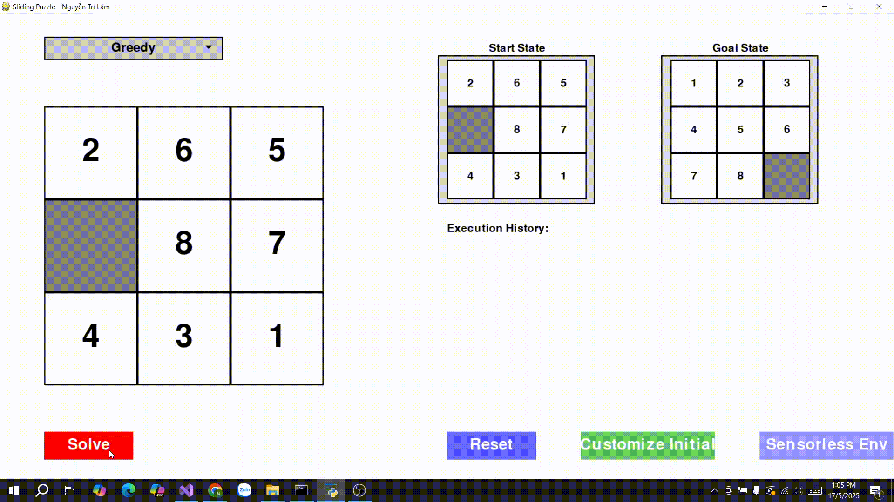|

### 🔍 So sánh các thuật toán tìm kiếm có thông tin (Informed Search Algorithms)

| **Thuật Toán**        | **Hoàn chỉnh** | **Tối ưu** | **Độ phức tạp thời gian** | **Độ phức tạp không gian** | **Hiệu suất trong 8-puzzle**                                                                   | **Ưu điểm**                                       | **Nhược điểm**                                          |
| --------------------- | -------------- | ---------- | ------------------------- | -------------------------- | ---------------------------------------------------------------------------------------------- | ------------------------------------------------- | ------------------------------------------------------- |
| **A\***               | Có             | Có         | `O(b^d)`                  | `O(b^d)`                   | ✔ Hiệu quả cao, tìm đường đi ngắn nhất nhanh hơn BFS/UCS nhờ heuristic. Phù hợp khi đủ bộ nhớ. | ✅ Tối ưu, hoàn chỉnh, nhanh hơn Uninformed Search | ❌ Tốn nhiều bộ nhớ, giảm hiệu suất với độ sâu lớn (>20) |
| **IDA\***             | Có             | Có         | `O(b^d)`                  | `O(bd)`                    | ✔ Tiết kiệm bộ nhớ, phù hợp cho hệ thống hạn chế tài nguyên. Chậm hơn A\* ở độ sâu lớn.        | ✅ Tối ưu, tiết kiệm bộ nhớ                        | ❌ Chậm hơn A\* do phải lặp lại nhiều lần                |
| **Greedy Best-First** | Không          | Không      | `O(b^m)`                  | `O(b^m)`                   | ✔ Nhanh, nhưng dễ bị kẹt hoặc tìm đường không tối ưu. Phù hợp khi cần kết quả nhanh.           | ✅ Nhanh, đơn giản                                 | ❌ Không tối ưu, có thể bỏ sót lời giải tốt hơn          |

### **Chú thích:**
* `b`: Số nhánh trung bình (trong 8-puzzle, thường ≈ 2–4 tùy vị trí ô trống).
* `d`: Độ sâu của lời giải tối ưu.
* `m`: Độ sâu tối đa của không gian trạng thái.
* **Heuristic sử dụng**: *Khoảng cách Manhattan* là heuristic **admissible** và **consistent**, đảm bảo tính tối ưu cho thuật toán **A\*** và **IDA\***.
---
### 📝 **Nhận xét chung:**

Các thuật toán **tìm kiếm có thông tin (Informed Search)** như **A\***, **IDA\*** và **Greedy Best-First Search** tận dụng heuristic để hướng dẫn quá trình tìm kiếm hiệu quả hơn so với các thuật toán không thông tin.

* **A\*** là lựa chọn **tối ưu nhất** nếu hệ thống có đủ bộ nhớ, nhờ vào tính chất tối ưu và nhanh nhờ sử dụng heuristic tốt (ví dụ: Manhattan).
* **IDA\*** phù hợp cho các môi trường **hạn chế tài nguyên** (như thiết bị nhúng, bộ nhớ thấp), vẫn đảm bảo tối ưu nhưng **hy sinh tốc độ** vì phải lặp lại nhiều lần.
* **Greedy Best-First Search** hoạt động **nhanh và đơn giản**, tuy nhiên **thiếu tính tối ưu**, dễ rơi vào bẫy cục bộ (local minima) nếu heuristic không tốt.

👉 **Tóm lại**:

* Nếu **ưu tiên chất lượng lời giải** và **có đủ tài nguyên**, hãy chọn **A\***.
* Nếu **ưu tiên tiết kiệm bộ nhớ**, chọn **IDA\***.
* Nếu **cần kết quả nhanh** và **không quá quan tâm tối ưu**, có thể thử **Greedy**.
---

## Local Search Algorithms
---
### 1. **Khái niệm chung về Local Search Algorithms**
- **Local Search** (tìm kiếm cục bộ) tập trung vào việc cải thiện một giải pháp hiện tại bằng cách khám phá các trạng thái lân cận, thay vì khám phá toàn bộ không gian trạng thái như các thuật toán Informed/Uninformed Search.
- Không duy trì một cây tìm kiếm hoặc hàng đợi các trạng thái, mà chỉ làm việc với trạng thái hiện tại và các trạng thái lân cận của nó.
- Thường sử dụng trong các bài toán tối ưu, khi không gian trạng thái lớn và mục tiêu là tìm giải pháp tốt (không nhất thiết tối ưu toàn cục).
- **Các thành phần chính**:
  - **Không gian trạng thái (State Space)**: Tập hợp tất cả các trạng thái có thể có (ví dụ: các hoán vị của ô trong 8-puzzle).
  - **Trạng thái ban đầu (Initial State)**: Một giải pháp khởi đầu, thường được chọn ngẫu nhiên hoặc cố định.
  - **Trạng thái mục tiêu (Goal State)**: Trạng thái lý tưởng hoặc tiêu chí tối ưu (ví dụ: trạng thái mục tiêu trong 8-puzzle hoặc giá trị hàm mục tiêu tối ưu).
  - **Hành động (Actions)**: Các thao tác để chuyển từ trạng thái hiện tại sang trạng thái lân cận (ví dụ: di chuyển ô trống trong 8-puzzle).
  - **Hàm mục tiêu (Objective Function)**: Đánh giá chất lượng của trạng thái, thường là hàm heuristic (như khoảng cách Manhattan) hoặc một hàm đánh giá khác. Trong tối ưu, có thể là tối thiểu hóa hoặc tối đa hóa giá trị hàm.
  - **Lân cận (Neighborhood)**: Tập hợp các trạng thái có thể đạt được từ trạng thái hiện tại bằng một hành động.

---

### 2. **Các thuật toán Local Search**

#### a. **Simple Hill Climbing**
- **Mô tả**: Chọn trạng thái lân cận đầu tiên có giá trị hàm mục tiêu tốt hơn trạng thái hiện tại (tối ưu hóa cục bộ).
- **Cách hoạt động**:
  1. Bắt đầu từ trạng thái ban đầu.
  2. Đánh giá các trạng thái lân cận, chọn trạng thái đầu tiên có giá trị hàm mục tiêu tốt hơn (ví dụ: khoảng cách Manhattan nhỏ hơn).
  3. Chuyển sang trạng thái lân cận đó, lặp lại cho đến khi không tìm thấy trạng thái lân cận nào tốt hơn (đỉnh cục bộ).
- **Đặc điểm**:
  - **Hoàn chỉnh**: Không, dễ bị kẹt ở cực trị cục bộ.
  - **Tối ưu**: Không, chỉ tìm giải pháp cục bộ.
  - **Độ phức tạp**:
    - Thời gian: Phụ thuộc vào số lân cận và số lần lặp, thường thấp (O(k) mỗi bước, với k là số lân cận).
    - Không gian: O(1), chỉ lưu trạng thái hiện tại và lân cận.
- **Ứng dụng**: Tìm giải pháp nhanh trong các bài toán như 8-puzzle, tối ưu hóa hàm đơn giản.

#### b. **Steepest-Ascent Hill Climbing**
- **Mô tả**: Xem xét tất cả các trạng thái lân cận và chọn trạng thái có giá trị hàm mục tiêu tốt nhất (tối ưu hóa cục bộ).
- **Cách hoạt động**:
  1. Bắt đầu từ trạng thái ban đầu.
  2. Đánh giá tất cả các trạng thái lân cận, chọn trạng thái có giá trị hàm mục tiêu tốt nhất (ví dụ: khoảng cách Manhattan nhỏ nhất).
  3. Chuyển sang trạng thái tốt nhất, lặp lại cho đến khi không có trạng thái lân cận nào tốt hơn.
- **Đặc điểm**:
  - **Hoàn chỉnh**: Không, có thể bị kẹt ở cực trị cục bộ.
  - **Tối ưu**: Không, nhưng thường tốt hơn Simple Hill Climbing do chọn trạng thái lân cận tốt nhất.
  - **Độ phức tạp**:
    - Thời gian: O(k) mỗi bước, với k là số lân cận, nhưng tốn thời gian hơn Simple Hill Climbing do đánh giá tất cả lân cận.
    - Không gian: O(k), để lưu danh sách lân cận.
- **Ứng dụng**: Phù hợp cho các bài toán như 8-puzzle khi cần cải thiện chất lượng giải pháp so với Simple Hill Climbing.

#### c. **Stochastic Hill Climbing**
- **Mô tả**: Chọn ngẫu nhiên một trạng thái lân cận có giá trị hàm mục tiêu tốt hơn trạng thái hiện tại, thay vì chọn trạng thái tốt nhất.
- **Cách hoạt động**:
  1. Bắt đầu từ trạng thái ban đầu.
  2. Tạo danh sách các trạng thái lân cận tốt hơn trạng thái hiện tại (dựa trên hàm mục tiêu).
  3. Chọn ngẫu nhiên một trạng thái từ danh sách đó, chuyển sang trạng thái này.
  4. Lặp lại cho đến khi không có trạng thái lân cận nào tốt hơn.
- **Đặc điểm**:
  - **Hoàn chỉnh**: Không, vẫn có thể bị kẹt ở cực trị cục bộ.
  - **Tối ưu**: Không, nhưng tính ngẫu nhiên giúp tránh một số cực trị cục bộ so với Simple/Steepest Hill Climbing.
  - **Độ phức tạp**:
    - Thời gian: O(k) mỗi bước, nhưng có thể nhanh hơn Steepest do không cần đánh giá tất cả lân cận.
    - Không gian: O(k), để lưu danh sách lân cận tốt hơn.
- **Ứng dụng**: Dùng khi muốn cân bằng giữa tốc độ và khả năng thoát khỏi cực trị cục bộ, như trong 8-puzzle hoặc bài toán tối ưu hóa.

#### d. **Simulated Annealing**
- **Mô tả**: Kết hợp tìm kiếm cục bộ với cơ chế ngẫu nhiên để thoát khỏi cực trị cục bộ, sử dụng khái niệm "nhiệt độ" (temperature) để điều khiển mức độ chấp nhận các trạng thái xấu hơn.
- **Cách hoạt động**:
  1. Bắt đầu từ trạng thái ban đầu, thiết lập nhiệt độ ban đầu cao và tốc độ giảm nhiệt độ (cooling rate).
  2. Chọn ngẫu nhiên một trạng thái lân cận.
  3. Chấp nhận trạng thái lân cận nếu:
     - Nó tốt hơn trạng thái hiện tại (theo hàm mục tiêu).
     - Hoặc, nếu xấu hơn, chấp nhận với xác suất `exp(-ΔE/T)`, với `ΔE` là độ chênh lệch hàm mục tiêu và `T` là nhiệt độ.
  4. Giảm nhiệt độ dần theo lịch trình (thường là `T = T * cooling_rate`).
  5. Lặp lại cho đến khi nhiệt độ đạt ngưỡng tối thiểu hoặc tìm được giải pháp đủ tốt.
- **Đặc điểm**:
  - **Hoàn chỉnh**: Không, nhưng có thể tìm giải pháp tốt nếu điều chỉnh lịch trình nhiệt độ phù hợp.
  - **Tối ưu**: Không, nhưng có khả năng thoát khỏi cực trị cục bộ, tiến gần giải pháp toàn cục.
  - **Độ phức tạp**:
    - Thời gian: Phụ thuộc vào số lần lặp và lịch trình nhiệt độ, thường cao hơn Hill Climbing.
    - Không gian: O(1), chỉ lưu trạng thái hiện tại và lân cận.
- **Ứng dụng**: Phù hợp cho các bài toán tối ưu phức tạp như 8-puzzle, lập lịch, hoặc tối ưu hóa hàm với nhiều cực trị cục bộ.

#### e. **Local Beam Search**
- **Mô tả**: Duy trì một tập hợp `k` trạng thái tốt nhất (beam) và mở rộng chúng, thay vì chỉ làm việc với một trạng thái như Hill Climbing.
- **Cách hoạt động**:
  1. Bắt đầu với `k` trạng thái ban đầu (thường chọn ngẫu nhiên).
  2. Tạo tất cả các trạng thái lân cận từ `k` trạng thái hiện tại.
  3. Chọn `k` trạng thái lân cận tốt nhất (dựa trên hàm mục tiêu).
  4. Lặp lại cho đến khi đạt trạng thái mục tiêu hoặc không cải thiện được thêm.
- **Đặc điểm**:
  - **Hoàn chỉnh**: Không, có thể bỏ sót giải pháp nếu beam không chứa trạng thái dẫn đến mục tiêu.
  - **Tối ưu**: Không, nhưng thường tìm được giải pháp tốt hơn Hill Climbing do khám phá nhiều trạng thái cùng lúc.
  - **Độ phức tạp**:
    - Thời gian: O(kb) mỗi bước, với b là số nhánh trung bình và k là kích thước beam.
    - Không gian: O(k), để lưu `k` trạng thái.
- **Ứng dụng**: Dùng trong các bài toán như 8-puzzle, khi cần cân bằng giữa khám phá nhiều trạng thái và tiết kiệm tài nguyên.

#### f. **Genetic Algorithm**
- **Mô tả**: Dựa trên cơ chế tiến hóa, duy trì một tập hợp các giải pháp (population) và cải thiện chúng qua các thế hệ bằng cách sử dụng **crossover**, **mutation**, và **selection**.
- **Cách hoạt động**:
  1. Khởi tạo một tập hợp các giải pháp ngẫu nhiên (population).
  2. Đánh giá chất lượng mỗi giải pháp bằng hàm mục tiêu (fitness function).
  3. Chọn các giải pháp tốt (selection) để tạo thế hệ mới thông qua:
     - **Crossover**: Kết hợp hai giải pháp để tạo giải pháp mới.
     - **Mutation**: Thay đổi ngẫu nhiên một phần của giải pháp để tăng tính đa dạng.
  4. Lặp lại qua nhiều thế hệ cho đến khi tìm được giải pháp đủ tốt hoặc đạt số thế hệ tối đa.
- **Đặc điểm**:
  - **Hoàn chỉnh**: Không, nhưng có thể tìm giải pháp tốt nếu điều chỉnh tham số hợp lý.
  - **Tối ưu**: Không, nhưng có khả năng tiến gần giải pháp toàn cục nhờ tính đa dạng của population.
  - **Độ phức tạp**:
    - Thời gian: Phụ thuộc vào kích thước population, số thế hệ, và chi phí đánh giá hàm mục tiêu.
    - Không gian: O(p), với p là kích thước population.
- **Ứng dụng**: Phù hợp cho các bài toán tối ưu hóa phức tạp như 8-puzzle, thiết kế, hoặc lập lịch, khi không gian trạng thái rất lớn.

---

### 3. **So sánh tổng quát**
| Thuật toán                     | Hoàn chỉnh | Tối ưu | Độ phức tạp thời gian | Độ phức tạp không gian | Ứng dụng chính |
|-------------------------------|------------|--------|-----------------------|------------------------|----------------|
| **Simple Hill Climbing**      | Không      | Không  | O(k) mỗi bước        | O(1)                  | Tìm giải pháp nhanh, đơn giản |
| **Steepest-Ascent Hill Climbing** | Không      | Không  | O(k) mỗi bước        | O(k)                  | Cải thiện giải pháp cục bộ |
| **Stochastic Hill Climbing**  | Không      | Không  | O(k) mỗi bước        | O(k)                  | Tránh cực trị cục bộ nhẹ |
| **Simulated Annealing**       | Không      | Không  | Phụ thuộc lịch trình | O(1)                  | Thoát cực trị cục bộ, tối ưu hóa |
| **Local Beam Search**         | Không      | Không  | O(kb) mỗi bước       | O(k)                  | Khám phá nhiều trạng thái |
| **Genetic Algorithm**         | Không      | Không  | Phụ thuộc population  | O(p)                  | Tối ưu hóa không gian lớn |

---

### 4. **Giải pháp tổng quát của Local Search**
- **Quy trình chung**:
  1. Chọn một trạng thái ban đầu (ngẫu nhiên hoặc cố định).
  2. Xác định hàm mục tiêu (ví dụ: khoảng cách Manhattan trong 8-puzzle) để đánh giá chất lượng trạng thái.
  3. Tạo và đánh giá các trạng thái lân cận, chọn hoặc chấp nhận trạng thái tiếp theo dựa trên chiến lược:
     - **Simple Hill Climbing**: Chọn trạng thái lân cận đầu tiên tốt hơn.
     - **Steepest-Ascent Hill Climbing**: Chọn trạng thái lân cận tốt nhất.
     - **Stochastic Hill Climbing**: Chọn ngẫu nhiên trạng thái lân cận tốt hơn.
     - **Simulated Annealing**: Chấp nhận trạng thái lân cận dựa trên xác suất liên quan đến nhiệt độ.
     - **Local Beam Search**: Duy trì và mở rộng `k` trạng thái tốt nhất.
     - **Genetic Algorithm**: Tiến hóa một tập hợp giải pháp qua selection, crossover, mutation.
  4. Lặp lại cho đến khi đạt trạng thái mục tiêu, cực trị cục bộ, hoặc giới hạn tài nguyên (thời gian, số bước).
- **Ưu điểm**:
  - Tiết kiệm bộ nhớ, vì chỉ làm việc với trạng thái hiện tại hoặc một tập nhỏ trạng thái.
  - Nhanh, đặc biệt khi không cần giải pháp tối ưu toàn cục.
  - Phù hợp cho không gian trạng thái lớn, như 8-puzzle, khi khám phá toàn bộ không khả thi.
- **Nhược điểm**:
  - Không đảm bảo hoàn chỉnh hoặc tối ưu, dễ bị kẹt ở cực trị cục bộ (trừ Simulated Annealing và Genetic Algorithm, có khả năng thoát cục bộ).
  - Hiệu quả phụ thuộc vào hàm mục tiêu và cách định nghĩa lân cận.
- **Yêu cầu**:
  - Hàm mục tiêu hiệu quả, phản ánh đúng chất lượng giải pháp.
  - Cơ chế thoát khỏi cực trị cục bộ (như ngẫu nhiên hóa hoặc lịch trình nhiệt độ).
  - Điều chỉnh tham số (nhiệt độ, kích thước beam, population, v.v.) để cân bằng giữa chất lượng và hiệu suất.
---    
### 📷 **Hình ảnh các thuật toán được áp dụng trong trò chơi**

| **Thuật Toán**                           | **Minh Họa GIF**                                           |
|-----------------------------------------|------------------------------------------------------------|
| **Simple Hill Climbing**                |  |
| **Steepest-Ascent Hill Climbing**       | 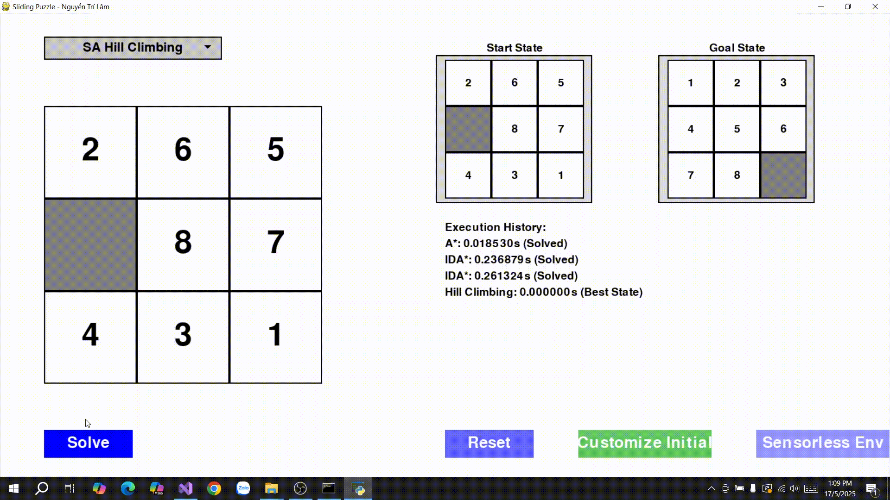 |
| **Stochastic Hill Climbing**            | 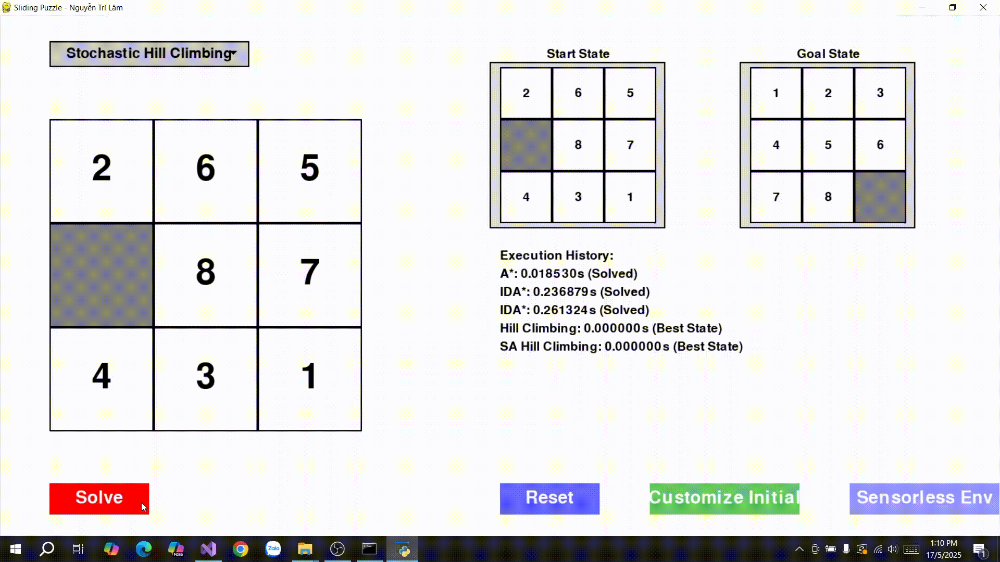 |
| **Simulated Annealing**                 |  |
| **Local Beam Search**                   | 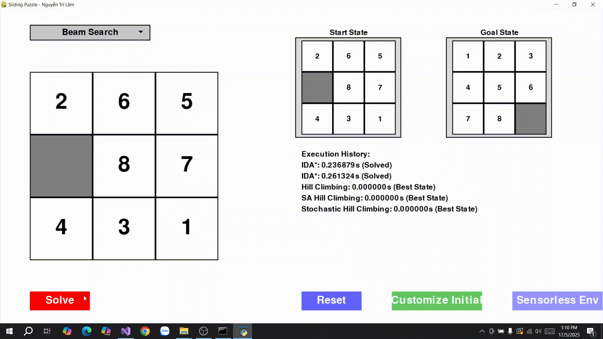 |
| **Genetic Algorithm**                   | 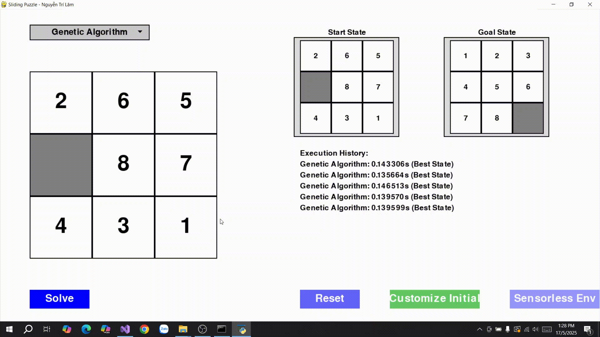 |

### 🔍 So sánh các thuật toán tìm kiếm cục bộ (Local Search Algorithms)

| **Thuật Toán**                    | **Hoàn chỉnh** | **Tối ưu** | **Độ phức tạp thời gian**     | **Độ phức tạp không gian** | **Hiệu suất trong 8-puzzle**                                                          | **Ưu điểm**                                   | **Nhược điểm**                                       |
| --------------------------------- | -------------- | ---------- | ----------------------------- | -------------------------- | ------------------------------------------------------------------------------------- | --------------------------------------------- | ---------------------------------------------------- |
| **Simple Hill Climbing**          | Không          | Không      | `O(k)` mỗi bước               | `O(1)`                     | Nhanh, nhưng dễ kẹt ở cực trị cục bộ, kém hiệu quả khi cách xa mục tiêu.              | ✅ Nhanh, tiết kiệm bộ nhớ                     | ❌ Dễ kẹt, không đảm bảo tìm được lời giải tốt        |
| **Steepest-Ascent Hill Climbing** | Không          | Không      | `O(k)` mỗi bước               | `O(k)`                     | Tốt hơn Simple, nhưng vẫn dễ kẹt ở cực trị cục bộ.                                    | ✅ Chọn lân cận tốt nhất, cải thiện chất lượng | ❌ Tốn thời gian hơn Simple, vẫn không đảm bảo tối ưu |
| **Stochastic Hill Climbing**      | Không          | Không      | `O(k)` mỗi bước               | `O(k)`                     | Nhanh hơn Steepest, tránh được một số cực trị cục bộ.                                 | ✅ Ngẫu nhiên, nhanh                           | ❌ Vẫn dễ kẹt, không tối ưu                           |
| **Simulated Annealing**           | Không          | Không      | Phụ thuộc lịch trình          | `O(1)`                     | Có thể thoát cực trị cục bộ, hiệu quả với trạng thái xa mục tiêu nếu tham số phù hợp. | ✅ Thoát cực trị cục bộ, tiết kiệm bộ nhớ      | ❌ Phụ thuộc tham số, tốc độ không ổn định            |
| **Local Beam Search**             | Không          | Không      | `O(kb)` mỗi bước              | `O(k)`                     | Tốt hơn Hill Climbing, nhưng phụ thuộc nhiều vào `beam_width`.                        | ✅ Khám phá đồng thời nhiều trạng thái         | ❌ Dễ bỏ sót lời giải nếu beam nhỏ                    |
| **Genetic Algorithm**             | Không          | Không      | Phụ thuộc population & thế hệ | `O(p)`                     | Hiệu quả nếu điều chỉnh tham số tốt, nhưng không đảm bảo tìm đúng lời giải.           | ✅ Khám phá không gian lớn, đa dạng lời giải   | ❌ Chậm, tốn tài nguyên, phụ thuộc nhiều vào tham số  |

### **Chú thích:**

* `k`: Số trạng thái lân cận (≈ 2–4 trong 8-puzzle, tùy vị trí ô trống).
* `b`: Số nhánh trung bình trong không gian trạng thái.
* `p`: Kích thước quần thể (*population size*) trong Genetic Algorithm.
* **Hàm mục tiêu**: Khoảng cách Manhattan được dùng như một heuristic phổ biến, tuy nhiên **không đảm bảo tính hoàn chỉnh/tối ưu trong local search**.

Dựa trên mã nguồn trong file `solve.py`, tôi sẽ phân tích và đưa ra nhận xét về hiệu suất của các thuật toán **Local Search** (**Simple Hill Climbing**, **Steepest-Ascent Hill Climbing**, **Stochastic Hill Climbing**, **Simulated Annealing**, **Local Beam Search**, và **Genetic Algorithm**) khi áp dụng vào bài toán **Sliding Puzzle 8 ô** (8-puzzle). Sau đó, tôi sẽ trình bày bảng so sánh chi tiết để minh họa các đặc điểm về hiệu suất, hoàn chỉnh, tối ưu, và độ phức tạp của các thuật toán này.

### 📝 **Nhận xét chung:**
- **Simple Hill Climbing**:
  - Nhanh nhất trong nhóm, nhưng dễ bị kẹt ở cực trị cục bộ, đặc biệt trong 8-puzzle do không gian trạng thái phức tạp.
  - Phù hợp khi cần kết quả nhanh với trạng thái ban đầu gần mục tiêu.
- **Steepest-Ascent Hill Climbing**:
  - Cải thiện so với Simple Hill Climbing bằng cách chọn lân cận tốt nhất, nhưng vẫn dễ bị kẹt.
  - Trong 8-puzzle, hiệu quả hơn Simple nhưng không phù hợp cho các cấu hình phức tạp.
- **Stochastic Hill Climbing**:
  - Tính ngẫu nhiên giúp tránh một số cực trị cục bộ, nhưng vẫn không đảm bảo tìm được mục tiêu trong 8-puzzle.
  - Nhanh hơn Steepest, nhưng hiệu quả phụ thuộc vào sự may mắn trong lựa chọn lân cận.
- **Simulated Annealing**:
  - Hiệu quả hơn Hill Climbing trong 8-puzzle nhờ khả năng thoát cực trị cục bộ, đặc biệt khi trạng thái ban đầu xa mục tiêu.
  - Hiệu suất phụ thuộc vào lịch trình nhiệt độ; trong mã, tham số mặc định (cooling_rate=0.99) khá hợp lý nhưng cần thử nghiệm thêm.
- **Local Beam Search**:
  - Cải thiện so với Hill Climbing bằng cách duy trì nhiều trạng thái, nhưng hiệu quả phụ thuộc vào `beam_width`.
  - Trong 8-puzzle, beam_width=3 có thể không đủ lớn để đảm bảo tìm mục tiêu trong không gian trạng thái lớn.
- **Genetic Algorithm**:
  - Phù hợp cho không gian trạng thái lớn, nhưng trong 8-puzzle, hiệu suất thấp hơn do chi phí tính toán cao và khó điều chỉnh tham số.
  - Cách biểu diễn chuỗi di chuyển trong mã sáng tạo, nhưng không đảm bảo tìm mục tiêu chính xác.
---
## Search with Nondeterministic Actions

---

### 1. **Khái niệm chung về Search with Nondeterministic Actions**
- **Search with Nondeterministic Actions** giải quyết các bài toán trong môi trường mà kết quả của một hành động không xác định (một hành động có thể dẫn đến nhiều trạng thái khác nhau).
- Thay vì tìm một chuỗi hành động cố định, thuật toán tìm một **kế hoạch** (plan) có thể xử lý mọi kết quả có thể xảy ra, thường được biểu diễn dưới dạng cây hoặc đồ thị.
- **AND-OR Search Trees** là một phương pháp chính để giải quyết bài toán này, mô phỏng hai loại nút:
  - **OR nodes**: Đại diện cho các lựa chọn của tác nhân (agent), nơi tác nhân chọn hành động tốt nhất.
  - **AND nodes**: Đại diện cho các kết quả không xác định của môi trường, nơi tất cả các kết quả phải được xử lý để đảm bảo kế hoạch thành công.
- **Mục tiêu**: Xây dựng một kế hoạch có điều kiện (contingency plan) đảm bảo đạt được trạng thái mục tiêu bất kể kết quả không xác định nào xảy ra.

 **Các thành phần chính của AND-OR Search Trees**
- **Không gian trạng thái (State Space)**: Tập hợp tất cả các trạng thái có thể có của bài toán (ví dụ: các hoán vị của ô trong 8-puzzle).
- **Trạng thái ban đầu (Initial State)**: Điểm xuất phát của bài toán.
- **Trạng thái mục tiêu (Goal State)**: Trạng thái cần đạt được.
- **Hành động (Actions)**: Các thao tác mà tác nhân có thể thực hiện (ví dụ: di chuyển ô trống lên, xuống, trái, phải trong 8-puzzle).
- **Kết quả không xác định (Nondeterministic Outcomes)**: Mỗi hành động có thể dẫn đến nhiều trạng thái khác nhau do môi trường không xác định (ví dụ: một hành động có thể bị ảnh hưởng bởi nhiễu hoặc tác nhân đối thủ).
- **Kế hoạch (Plan)**: Một cấu trúc dạng cây hoặc đồ thị, bao gồm:
  - **OR nodes**: Tác nhân chọn một hành động từ tập hành động khả thi.
  - **AND nodes**: Môi trường trả về một tập hợp các trạng thái có thể xảy ra, và kế hoạch phải giải quyết tất cả các trạng thái này.
- **Hàm đánh giá (Evaluation Function)**: Có thể sử dụng heuristic (như khoảng cách Manhattan trong 8-puzzle) để ưu tiên các nhánh OR có khả năng dẫn đến mục tiêu nhanh hơn.
- **Điều kiện dừng**: Đạt trạng thái mục tiêu hoặc xác định không có giải pháp.

---

### 2. **Giải pháp tổng quát của AND-OR Search Trees**
- **Mô tả**:
  - AND-OR Search Trees xây dựng một cây tìm kiếm xen kẽ giữa **OR nodes** (lựa chọn hành động của tác nhân) và **AND nodes** (các kết quả không xác định của môi trường).
  - Mục tiêu là tìm một **subtree** (cây con) mà:
    - Bắt đầu từ trạng thái ban đầu.
    - Đảm bảo đạt được trạng thái mục tiêu bất kể kết quả không xác định nào xảy ra.
  - Kế hoạch kết quả là một **cây có điều kiện**, trong đó mỗi nhánh AND đại diện cho một kịch bản có thể xảy ra, và mỗi nhánh OR đại diện cho một quyết định của tác nhân.
- **Cách hoạt động**:
  1. **Khởi tạo**: Bắt đầu từ trạng thái ban đầu, tạo một OR node đại diện cho tác nhân.
  2. **Mở rộng OR node**:
     - Liệt kê tất cả các hành động khả thi từ trạng thái hiện tại.
     - Với mỗi hành động, tạo một AND node đại diện cho các kết quả không xác định của hành động đó.
  3. **Mở rộng AND node**:
     - Với mỗi kết quả không xác định, tạo một OR node mới cho trạng thái tương ứng.
     - Tiếp tục xen kẽ OR và AND nodes.
  4. **Đánh giá**:
     - Một OR node thành công nếu ít nhất một nhánh con của nó (qua một hành động) dẫn đến giải pháp.
     - Một AND node thành công nếu tất cả các nhánh con của nó (tất cả kết quả không xác định) dẫn đến giải pháp.
  5. **Điều kiện dừng**:
     - Nếu đạt trạng thái mục tiêu, trả về kế hoạch.
     - Nếu một OR node không có nhánh nào thành công hoặc một AND node có nhánh thất bại, quay lui (backtrack).
     - Nếu không tìm được giải pháp, kết luận không có kế hoạch khả thi.
- **Đặc điểm**:
  - **Hoàn chỉnh**: Có, nếu không gian trạng thái hữu hạn và có giải pháp, AND-OR Search sẽ tìm được kế hoạch.
  - **Tối ưu**: Có thể tối ưu nếu sử dụng heuristic để ưu tiên các hành động tại OR nodes (ví dụ: chọn hành động giảm khoảng cách Manhattan).
  - **Độ phức tạp**:
    - **Thời gian**: O(b^m), với b là số nhánh trung bình (số hành động hoặc kết quả không xác định) và m là độ sâu tối đa của cây. Trong môi trường phức tạp, chi phí có thể rất cao.
    - **Không gian**: O(bm) nếu sử dụng tìm kiếm đệ quy, nhưng có thể giảm bằng cách lưu trữ trạng thái đã thăm.
- **Ứng dụng**:
  - Bài toán trong môi trường không xác định, như lập kế hoạch trong robotics, trò chơi với đối thủ (adversarial games), hoặc bài toán như 8-puzzle với nhiễu (ví dụ: ô trống di chuyển ngẫu nhiên).
  - Xử lý các tình huống cần kế hoạch có điều kiện, đảm bảo thành công bất kể kết quả nào xảy ra.
---
### 3. **So sánh tổng quát**
| Thuật toán           | Hoàn chỉnh | Tối ưu | Độ phức tạp thời gian | Độ phức tạp không gian | Ứng dụng chính |
|----------------------|------------|--------|-----------------------|------------------------|----------------|
| **AND-OR Search Trees** | Có (nếu hữu hạn) | Có (nếu dùng heuristic) | O(b^m)               | O(bm)                 | Lập kế hoạch trong môi trường không xác định (robotics, trò chơi, 8-puzzle với nhiễu) |
---
### 4. **Cấu trúc của AND-OR Search Tree**
- **OR nodes**:
  - Đại diện cho trạng thái mà tác nhân phải chọn hành động.
  - Thành công nếu ít nhất một hành động dẫn đến giải pháp.
  - Ví dụ: Trong 8-puzzle, tác nhân chọn di chuyển ô trống lên, xuống, trái, hoặc phải.
- **AND nodes**:
  - Đại diện cho các kết quả không xác định của một hành động.
  - Thành công nếu tất cả các kết quả đều dẫn đến giải pháp.
  - Ví dụ: Nếu môi trường có nhiễu, di chuyển "lên" có thể dẫn đến nhiều trạng thái khác nhau.
- **Kế hoạch kết quả**:
  - Một cây với các nhánh OR (lựa chọn hành động) và AND (xử lý tất cả kết quả).
  - Ví dụ trong 8-puzzle: "Nếu trạng thái là S1, di chuyển lên; nếu kết quả là S2, di chuyển phải; nếu kết quả là S3, di chuyển xuống."

- **Ưu điểm**:
  - Xử lý tốt các môi trường không xác định, đảm bảo kế hoạch khả thi cho mọi kịch bản.
  - Linh hoạt, có thể kết hợp với heuristic để cải thiện hiệu suất.
  - Hoàn chỉnh trong không gian trạng thái hữu hạn.
- **Nhược điểm**:
  - Độ phức tạp cao trong môi trường có nhiều kết quả không xác định.
  - Yêu cầu bộ nhớ lớn nếu không gian trạng thái phức tạp, trừ khi sử dụng kỹ thuật tối ưu như lưu trữ trạng thái đã thăm.
  - Cần xác định rõ các kết quả không xác định của mỗi hành động, có thể khó trong một số bài toán thực tế.
---
### 📷 **Hình ảnh các thuật toán được áp dụng trong trò chơi**

| **Thuật Toán**             | **Minh Họa GIF**                                         |
|----------------------------|----------------------------------------------------------|
| **AND-OR Search Trees**    | 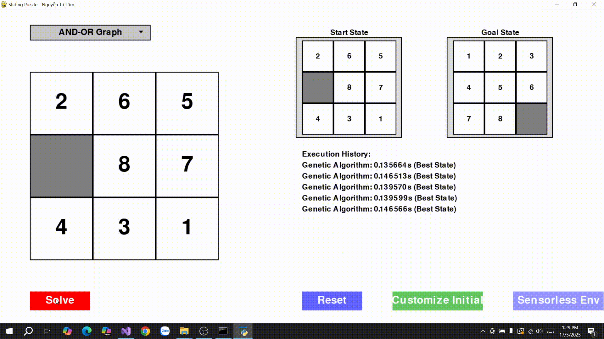 |

### 🔍 So sánh thuật toán tìm kiếm với hành động không xác định (Search with Nondeterministic Actions)

| **Thuật toán**         | **Hoàn chỉnh** | **Tối ưu** | **Độ phức tạp thời gian** | **Độ phức tạp không gian** | **Hiệu suất trong 8-puzzle** | **Ưu điểm** | **Nhược điểm** |
|-----------------------|----------------|------------|---------------------------|----------------------------|------------------------------|-------------|----------------|
| **AND-OR Search Tree** | Có (nếu hữu hạn) | Có (nếu dùng heuristic) | O(b^m)                   | O(bm)                     | Hiệu quả khi xử lý môi trường không xác định, nhưng chậm và tốn tài nguyên nếu số kết quả không xác định lớn. | Xử lý không xác định, hoàn chỉnh, có thể tối ưu. | Độ phức tạp cao, tốn bộ nhớ, phụ thuộc vào mô hình không xác định. |

**Ghi chú**:
- **b**: Số nhánh trung bình, phụ thuộc vào số hành động và số kết quả không xác định mỗi hành động (trong 8-puzzle, b có thể từ 2-4 cho hành động và tăng thêm do nhiễu).
- **m**: Độ sâu tối đa của cây tìm kiếm.
- **Heuristic**: Khoảng cách Manhattan được sử dụng trong mã, là admissible và giúp ưu tiên các nhánh OR hiệu quả.
- **Môi trường không xác định**: Trong `solve.py`, giả định rằng mỗi hành động có thể dẫn đến một tập hợp trạng thái (AND nodes), ví dụ: do nhiễu hoặc đối thủ.

---
### 📝 **Nhận xét chung:**
  - AND-OR Search Tree là lựa chọn phù hợp khi bài toán 8-puzzle được mở rộng để bao gồm yếu tố không xác định, như nhiễu môi trường hoặc hành động của đối thủ làm thay đổi trạng thái.
  - Trong mã, việc sử dụng khoảng cách Manhattan làm heuristic giúp thuật toán ưu tiên các hành động đưa trạng thái gần mục tiêu, cải thiện hiệu suất so với tìm kiếm không định hướng.
  - Tuy nhiên, thuật toán này không hiệu quả bằng các thuật toán xác định như A* hoặc IDA* trong 8-puzzle thông thường, vì nó phải xử lý nhiều kết quả không xác định, làm tăng chi phí tính toán.
---
## Searching with no observation và Searching in partially observable environments
---
### 1. **Searching with No Observation (Tìm kiếm không quan sát)**

#### **Khái niệm chung**
- **Searching with No Observation** áp dụng cho các bài toán trong môi trường mà tác nhân (agent) không nhận được thông tin về trạng thái hiện tại sau khi thực hiện hành động (không có quan sát hoặc cảm biến).
- Tác nhân chỉ biết trạng thái ban đầu, tập hợp hành động, và mô hình chuyển đổi trạng thái (transition model), nhưng không thể quan sát trạng thái sau mỗi bước.
- Mục tiêu là xây dựng một **kế hoạch hành động mở** (open-loop plan), tức là một chuỗi hành động cố định để đạt mục tiêu bất kể trạng thái thực tế.
- Thường áp dụng trong môi trường xác định hoặc không xác định, nhưng không có thông tin phản hồi.

#### **Các thành phần chính**
- **Không gian trạng thái (State Space)**: Tập hợp tất cả các trạng thái có thể có (ví dụ: các hoán vị trong 8-puzzle).
- **Trạng thái ban đầu (Initial State)**: Điểm xuất phát, giả định tác nhân biết trạng thái này.
- **Trạng thái mục tiêu (Goal State)**: Trạng thái cần đạt được.
- **Hành động (Actions)**: Các thao tác khả thi (ví dụ: di chuyển ô trống lên, xuống, trái, phải trong 8-puzzle).
- **Mô hình chuyển đổi trạng thái (Transition Model)**: Quy tắc xác định trạng thái tiếp theo sau một hành động (có thể xác định hoặc không xác định).
- **Tập niềm tin (Belief State)**: Vì không có quan sát, tác nhân duy trì một tập hợp các trạng thái có thể có (belief state) dựa trên trạng thái ban đầu và lịch sử hành động.
- **Kế hoạch (Plan)**: Một chuỗi hành động cố định hoặc một chính sách (policy) đảm bảo đạt mục tiêu từ trạng thái ban đầu.

#### **Giải pháp tổng quát**
- **Mô tả**: 
  - Tác nhân xây dựng một kế hoạch dựa trên mô hình chuyển đổi trạng thái, giả định rằng không có thông tin mới thu thập được trong quá trình thực hiện.
  - Trong môi trường xác định, kế hoạch là một chuỗi hành động cố định.
  - Trong môi trường không xác định, kế hoạch phải xem xét tất cả các trạng thái có thể có trong tập niềm tin (belief state).
- **Cách hoạt động**:
  1. **Khởi tạo**: Bắt đầu từ trạng thái ban đầu hoặc tập niềm tin ban đầu (chỉ chứa trạng thái ban đầu).
  2. **Dự đoán trạng thái**: Dựa trên mô hình chuyển đổi, tính toán tập niềm tin mới sau mỗi hành động (bao gồm tất cả trạng thái có thể xảy ra).
  3. **Lập kế hoạch**:
     - Chọn chuỗi hành động dẫn tập niềm tin đến một trạng thái chứa mục tiêu.
     - Trong môi trường không xác định, sử dụng kỹ thuật như **Belief-State Search** (tìm kiếm trong không gian tập niềm tin) để đảm bảo tất cả trạng thái trong tập niềm tin đều đạt mục tiêu.
  4. **Thực thi**: Thực hiện chuỗi hành động mà không cần quan sát, hy vọng đạt mục tiêu.
- **Đặc điểm**:
  - **Hoàn chỉnh**: Có, nếu không gian trạng thái hữu hạn và tồn tại kế hoạch khả thi.
  - **Tối ưu**: Có thể tối ưu nếu sử dụng hàm chi phí (ví dụ: số bước tối thiểu), nhưng khó trong môi trường không xác định.
  - **Độ phức tạp**:
    - **Thời gian**: O(|B|^d), với |B| là kích thước tập niềm tin và d là độ sâu kế hoạch.
    - **Không gian**: O(|B|), để lưu trữ tập niềm tin.
- **Ứng dụng**:
  - Robotics trong môi trường không cảm biến (ví dụ: robot di chuyển trong bóng tối).
  - 8-puzzle với giả định không quan sát trạng thái sau mỗi di chuyển (tác nhân chỉ biết trạng thái ban đầu và thực hiện chuỗi hành động cố định).
- **Ví dụ trong 8-puzzle**:
  - Tác nhân biết trạng thái ban đầu (ví dụ: `[2, 6, 5, 0, 8, 7, 4, 3, 1]`).
  - Không quan sát trạng thái sau mỗi di chuyển, chỉ thực hiện chuỗi hành động cố định (ví dụ: "lên, trái, xuống").
  - Kế hoạch phải đảm bảo trạng thái mục tiêu (`[1, 2, 3, 4, 5, 6, 7, 8, 0]`) nằm trong tập niềm tin cuối cùng.

#### **Ưu và nhược điểm**
- **Ưu điểm**:
  - Đơn giản trong môi trường xác định, vì chỉ cần một chuỗi hành động cố định.
  - Có thể xử lý môi trường không xác định bằng cách duy trì tập niềm tin.
- **Nhược điểm**:
  - Không hiệu quả nếu tập niềm tin lớn (trong 8-puzzle, tập niềm tin có thể lên đến 9!/2 trạng thái).
  - Không tận dụng được thông tin mới, dẫn đến kế hoạch bảo thủ (overly cautious).
  - Khó tối ưu trong môi trường không xác định do phải xử lý tất cả trạng thái có thể.

---

### 2. **Searching in Partially Observable Environments (Tìm kiếm trong môi trường quan sát một phần)**

#### **Khái niệm chung**
- **Searching in Partially Observable Environments** áp dụng cho các bài toán mà tác nhân nhận được một số thông tin quan sát (observation) sau mỗi hành động, nhưng không đủ để xác định trạng thái chính xác.
- Tác nhân phải duy trì một **tập niềm tin** (belief state) dựa trên trạng thái ban đầu, lịch sử hành động, và các quan sát.
- Mục tiêu là xây dựng một **kế hoạch có điều kiện** (contingency plan) hoặc chính sách (policy) để đạt mục tiêu, sử dụng thông tin quan sát để điều chỉnh hành động.
- Thường được mô hình hóa dưới dạng **Partially Observable Markov Decision Process (POMDP)**.

#### **Các thành phần chính**
- **Không gian trạng thái (State Space)**: Tất cả các trạng thái có thể có.
- **Trạng thái ban đầu (Initial State)**: Một trạng thái hoặc tập niềm tin ban đầu.
- **Trạng thái mục tiêu (Goal State)**: Trạng thái cần đạt được.
- **Hành động (Actions)**: Các thao tác khả thi.
- **Mô hình chuyển đổi trạng thái (Transition Model)**: Xác suất hoặc quy tắc chuyển đổi giữa các trạng thái sau hành động.
- **Quan sát (Observations)**: Thông tin mà tác nhân nhận được sau mỗi hành động (ví dụ: vị trí của một số ô trong 8-puzzle).
- **Mô hình quan sát (Observation Model)**: Liên kết trạng thái với các quan sát có thể (ví dụ: xác suất nhận được quan sát O trong trạng thái S).
- **Tập niềm tin (Belief State)**: Một phân phối xác suất hoặc tập hợp các trạng thái có thể, cập nhật dựa trên hành động và quan sát.
- **Kế hoạch (Plan)**: Một chính sách hoặc cây có điều kiện, ánh xạ tập niềm tin đến hành động hoặc chuỗi hành động.

#### **Giải pháp tổng quát**
- **Mô tả**:
  - Tác nhân duy trì một tập niềm tin và cập nhật nó sau mỗi hành động và quan sát, sử dụng **lọc Bayes** (Bayesian filtering) hoặc các phương pháp tương tự.
  - Kế hoạch là một chính sách (policy) ánh xạ từ tập niềm tin đến hành động, hoặc một cây có điều kiện dựa trên các quan sát nhận được.
  - Thuật toán thường sử dụng **Belief-State Search** hoặc các kỹ thuật như POMDP để tìm kế hoạch tối ưu.
- **Cách hoạt động**:
  1. **Khởi tạo**: Bắt đầu với tập niềm tin ban đầu (có thể là một trạng thái hoặc phân phối xác suất).
  2. **Cập nhật tập niềm tin**:
     - Sau mỗi hành động, dự đoán tập niềm tin mới dựa trên mô hình chuyển đổi.
     - Sau mỗi quan sát, cập nhật tập niềm tin bằng cách loại bỏ các trạng thái không phù hợp (hoặc điều chỉnh xác suất trong POMDP).
  3. **Lập kế hoạch**:
     - Tìm kiếm trong không gian tập niềm tin, sử dụng heuristic (như khoảng cách Manhattan trung bình trong tập niềm tin) để ưu tiên hành động.
     - Xây dựng cây có điều kiện: "Thực hiện hành động A; nếu nhận quan sát O1, làm X; nếu nhận O2, làm Y."
  4. **Thực thi**:
     - Thực hiện hành động, nhận quan sát, cập nhật tập niềm tin, và lặp lại cho đến khi tập niềm tin chỉ chứa trạng thái mục tiêu.
- **Đặc điểm**:
  - **Hoàn chỉnh**: Có, nếu không gian trạng thái và quan sát hữu hạn, và tồn tại kế hoạch khả thi.
  - **Tối ưu**: Có thể tối ưu nếu sử dụng hàm chi phí và giải POMDP chính xác, nhưng thường phải xấp xỉ do độ phức tạp cao.
  - **Độ phức tạp**:
    - **Thời gian**: O(|B|^d), với |B| là số tập niềm tin có thể (có thể rất lớn, thậm chí vô hạn nếu tập niềm tin là phân phối liên tục).
    - **Không gian**: O(|B|), để lưu trữ tập niềm tin và cây kế hoạch.
- **Ứng dụng**:
  - Robotics với cảm biến hạn chế (ví dụ: robot định vị với GPS không chính xác).
  - Trò chơi với thông tin không đầy đủ.
  - 8-puzzle với quan sát một phần (ví dụ: chỉ thấy vị trí của một số ô sau mỗi di chuyển).
- **Ví dụ trong 8-puzzle**:
  - Tác nhân chỉ thấy vị trí của ô trống hoặc một số ô sau mỗi di chuyển.
  - Duy trì tập niềm tin về các trạng thái có thể, cập nhật dựa trên quan sát (ví dụ: "ô trống ở vị trí (2,2)").
  - Xây dựng kế hoạch: "Di chuyển lên; nếu ô trống ở (1,2), di chuyển trái; nếu ở (2,1), di chuyển xuống."

#### **Ưu và nhược điểm**
- **Ưu điểm**:
  - Tận dụng thông tin quan sát để thu hẹp tập niềm tin, hiệu quả hơn tìm kiếm không quan sát.
  - Linh hoạt, có thể xử lý môi trường xác định hoặc không xác định.
- **Nhược điểm**:
  - Độ phức tạp cao, đặc biệt khi không gian tập niềm tin lớn hoặc quan sát phức tạp.
  - Yêu cầu mô hình quan sát và chuyển đổi chính xác, khó triển khai trong thực tế.
  - Giải POMDP chính xác thường không khả thi, cần xấp xỉ.

---

### 3. **So sánh tổng quát**
| Nhóm thuật toán                          | Hoàn chỉnh | Tối ưu | Độ phức tạp thời gian | Độ phức tạp không gian | Ứng dụng chính |
|------------------------------------------|------------|--------|-----------------------|------------------------|----------------|
| **Searching with No Observation**        | Có (nếu hữu hạn) | Có (trong môi trường xác định) | O(|B|^d)             | O(|B|)                | Robotics không cảm biến, 8-puzzle không quan sát |
| **Searching in Partially Observable Environments** | Có (nếu hữu hạn) | Có (nếu giải POMDP) | O(|B|^d)             | O(|B|)                | Robotics với cảm biến hạn chế, trò chơi, 8-puzzle với quan sát một phần |

**Ghi chú**:
- **|B|**: Kích thước không gian tập niềm tin, có thể rất lớn trong môi trường phức tạp.
- **d**: Độ sâu kế hoạch hoặc số bước cần thiết để đạt mục tiêu.

### 📷 **Hình ảnh các thuật toán được áp dụng trong trò chơi**

| **Thuật Toán / Phương pháp**                        | **Minh Họa GIF**                                                       |
|-----------------------------------------------------|------------------------------------------------------------------------|
| **Searching with No Observation**                  | 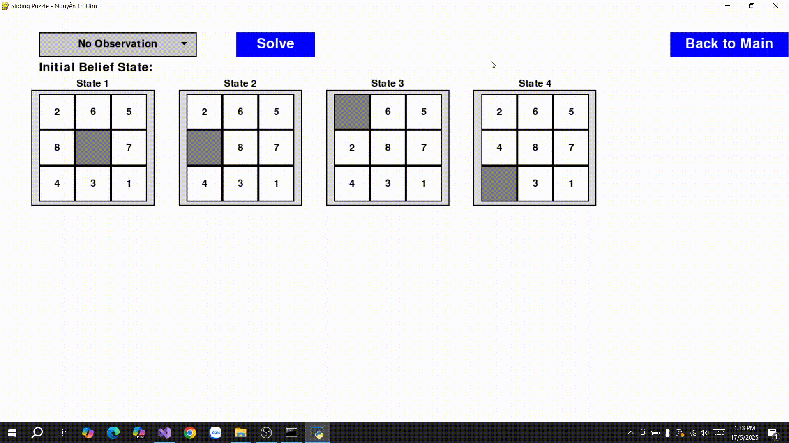 |
| **Searching in Partially Observable Environments** | 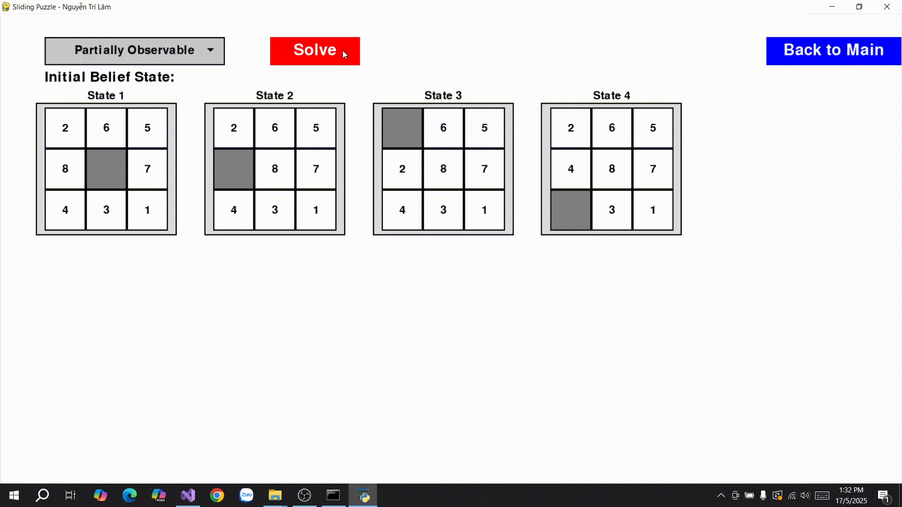 |
|----------------------------------------------------|-------------------------------------------------------------------------|
| **Bổ sung trường hợp khởi tạo ban đầu dễ**        |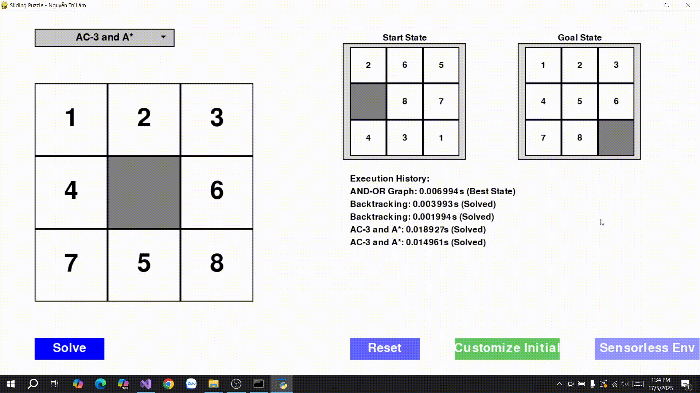|

### 🔍 So sánh các thuật toán tìm kiếm với môi trường không quan sát (Searching with No Observation) và tìm kiếm với môi trường không quan sát một phần (Searching in Partially Observable Environments)

| **Thuật toán**                          | **Hoàn chỉnh** | **Tối ưu** | **Độ phức tạp thời gian** | **Độ phức tạp không gian** | **Hiệu suất trong 8-puzzle** | **Ưu điểm** | **Nhược điểm** |
|-----------------------------------------|----------------|------------|---------------------------|----------------------------|------------------------------|-------------|----------------|
| **Searching with No Observation**       | Có (nếu hữu hạn) | Không      | O(\|B\|^d)               | O(\|B\|)                  | Hiệu quả thấp, phù hợp khi không có cảm biến, nhưng tốn tài nguyên nếu tập niềm tin lớn. | Đơn giản, xử lý môi trường không quan sát. | Tập niềm tin lớn, không tối ưu, không tận dụng thông tin. |
| **Searching in Partially Observable Environments** | Có (nếu hữu hạn) | Không      | O(\|B\|^d)               | O(\|B\|)                  | Hiệu quả hơn No Observation, phụ thuộc vào chất lượng quan sát. Tốt khi quan sát mạnh. | Tận dụng quan sát, linh hoạt. | Độ phức tạp cao, phụ thuộc mô hình quan sát, không tối ưu. |

**Ghi chú**:
- **|B|**: Kích thước không gian tập niềm tin, có thể lên đến 9!/2 (≈ 181,440) trong 8-puzzle nếu không có hoặc ít quan sát.
- **d**: Độ sâu kế hoạch hoặc số bước cần thiết để đạt mục tiêu.
- **Heuristic**: Khoảng cách Manhattan được sử dụng trong mã, giúp ưu tiên hành động nhưng không đảm bảo tối ưu trong môi trường không xác định.
---
### 📝 **Nhận xét chung:**
- **Searching with No Observation**:
  - Phù hợp cho các kịch bản 8-puzzle không có cảm biến, nhưng hiệu suất thấp do tập niềm tin có thể mở rộng nhanh chóng (đặc biệt trong môi trường không xác định).
  - Trong mã, việc sử dụng khoảng cách Manhattan làm heuristic giúp giảm số hành động cần xem xét, nhưng vẫn không thể cạnh tranh với các thuật toán như A* trong môi trường xác định.
  - Chỉ thực sự hữu ích khi mô hình chuyển đổi đơn giản và số trạng thái trong tập niềm tin được kiểm soát.
- **Searching in Partially Observable Environments**:
  - Hiệu quả hơn Searching with No Observation nhờ tận dụng quan sát để thu hẹp tập niềm tin.
  - Trong 8-puzzle, hiệu suất phụ thuộc vào chất lượng quan sát. Nếu quan sát mạnh (ví dụ: biết vị trí ô trống và một số ô), thuật toán có thể gần với hiệu suất của A*. Nếu quan sát yếu, tập niềm tin vẫn lớn, dẫn đến chi phí tính toán cao.
  - Trong mã, việc cập nhật tập niềm tin và xây dựng kế hoạch có điều kiện là phù hợp, nhưng yêu cầu mô hình quan sát chính xác.
- **Tình huống phù hợp**:
  - **No Observation**: Hữu ích khi 8-puzzle được mô hình hóa không có cảm biến (ví dụ: tác nhân chỉ biết trạng thái ban đầu và thực hiện chuỗi di chuyển cố định).
  - **Partially Observable**: Phù hợp khi có quan sát một phần (ví dụ: biết vị trí ô trống), đặc biệt trong các kịch bản thực tế như robotics hoặc trò chơi với thông tin hạn chế.
---
### Constraint Satisfaction Problems
---
### 1. **Khái niệm chung về Constraint Satisfaction Problems (CSPs)**
- **Constraint Satisfaction Problems (CSPs)** là một cách biểu diễn bài toán tìm kiếm, trong đó mục tiêu là gán giá trị cho các biến sao cho thỏa mãn một tập hợp các ràng buộc (constraints).
- CSPs thường được sử dụng trong các bài toán có cấu trúc ràng buộc rõ ràng, như lập lịch, tô màu bản đồ, hoặc giải câu đố logic.
- Thay vì tìm kiếm trực tiếp trong không gian trạng thái, CSPs biểu diễn bài toán dưới dạng **biến**, **miền giá trị**, và **ràng buộc**, sau đó sử dụng các kỹ thuật như AC-3 và Backtracking để tìm giải pháp.

---
### 2. **Các thành phần chính của CSPs**
- **Biến (Variables)**: Các đối tượng cần gán giá trị (ví dụ: trong 8-puzzle, mỗi ô có thể được xem là một biến đại diện cho giá trị tại vị trí đó).
- **Miền giá trị (Domains)**: Tập hợp các giá trị khả thi cho mỗi biến (ví dụ: trong 8-puzzle, miền giá trị là {0, 1, 2, ..., 8}, với 0 là ô trống).
- **Ràng buộc (Constraints)**: Các điều kiện phải thỏa mãn giữa các biến, có thể là:
  - **Ràng buộc đơn (Unary Constraints)**: Liên quan đến một biến (ví dụ: ô ở vị trí (1,1) không thể là 0).
  - **Ràng buộc đôi (Binary Constraints)**: Liên quan đến hai biến (ví dụ: hai ô không thể có cùng giá trị).
  - **Ràng buộc toàn cục (Global Constraints)**: Liên quan đến nhiều biến (ví dụ: tất cả các ô phải tạo thành một hoán vị hợp lệ).
- **Trạng thái mục tiêu (Solution)**: Một gán giá trị đầy đủ (assignment) cho tất cả các biến, thỏa mãn tất cả các ràng buộc.
- **Không gian trạng thái**: Tập hợp tất cả các gán giá trị có thể cho các biến, giới hạn bởi miền giá trị và ràng buộc.

---
### 3. **Giải pháp tổng quát của CSPs**

#### **a. AC-3 (Arc Consistency Algorithm)**
- **Mô tả**:
  - AC-3 là một thuật toán tiền xử lý (preprocessing) dùng để giảm miền giá trị của các biến bằng cách đảm bảo **tính nhất quán cung** (arc consistency).
  - Một cung (arc) giữa hai biến \(X_i\) và \(X_j\) là nhất quán nếu với mỗi giá trị trong miền của \(X_i\), tồn tại ít nhất một giá trị trong miền của \(X_j\) thỏa mãn ràng buộc giữa chúng.
  - AC-3 loại bỏ các giá trị không thỏa mãn ràng buộc, thu hẹp miền giá trị để giảm không gian tìm kiếm trước khi áp dụng thuật toán tìm kiếm chính (như Backtracking).
- **Cách hoạt động**:
  1. **Khởi tạo**: Tạo một hàng đợi chứa tất cả các cung (arcs) tương ứng với các ràng buộc đôi trong CSP.
  2. **Xử lý cung**:
     - Lấy một cung \((X_i, X_j)\) từ hàng đợi.
     - Kiểm tra tính nhất quán của cung: Với mỗi giá trị trong miền của \(X_i\), đảm bảo tồn tại giá trị trong miền của \(X_j\) thỏa mãn ràng buộc.
     - Nếu một giá trị trong miền của \(X_i\) không thỏa mãn, loại bỏ giá trị đó.
  3. **Cập nhật hàng đợi**:
     - Nếu miền của \(X_i\) bị thay đổi, thêm tất cả các cung liên quan đến \(X_i\) (như \((X_k, X_i)\)) vào hàng đợi để kiểm tra lại.
  4. **Kết thúc**:
     - Tiếp tục cho đến khi hàng đợi rỗng (miền đã nhất quán) hoặc một miền trở nên rỗng (không có giải pháp).
- **Đặc điểm**:
  - **Hoàn chỉnh**: Không, AC-3 chỉ là tiền xử lý, không đảm bảo tìm giải pháp mà chỉ giảm kích thước miền.
  - **Tối ưu**: Không liên quan, vì AC-3 không tìm giải pháp mà chỉ tối ưu không gian tìm kiếm.
  - **Độ phức tạp**:
    - **Thời gian**: O(e * d^3) trong trường hợp xấu nhất, với e là số cung và d là kích thước miền lớn nhất.
    - **Không gian**: O(e), để lưu hàng đợi các cung.
- **Ứng dụng**:
  - Tiền xử lý cho các bài toán CSP như 8-puzzle, tô màu bản đồ, hoặc lập lịch, giúp giảm miền giá trị trước khi tìm kiếm.
  - Trong 8-puzzle, AC-3 có thể đảm bảo rằng các ô lân cận có giá trị phù hợp với các ràng buộc về hoán vị.

#### **b. Backtracking Search**
- **Mô tả**:
  - Backtracking Search là một thuật toán tìm kiếm đệ quy, gán giá trị cho các biến một cách tuần tự và quay lui (backtrack) khi gặp gán không thỏa mãn ràng buộc.
  - Thường được cải tiến với các kỹ thuật như chọn biến thông minh (most constrained variable), chọn giá trị tối ưu (least constraining value), và kiểm tra ràng buộc sớm (forward checking).
- **Cách hoạt động**:
  1. **Khởi tạo**: Bắt đầu với một gán rỗng (không biến nào được gán giá trị).
  2. **Chọn biến**: Chọn một biến chưa được gán (có thể dùng tiêu chí như biến có miền nhỏ nhất để giảm số nhánh).
  3. **Gán giá trị**: Thử từng giá trị trong miền của biến, kiểm tra xem gán này có thỏa mãn tất cả ràng buộc liên quan không.
  4. **Đệ quy**:
     - Nếu gán hợp lệ, chuyển sang biến tiếp theo và lặp lại.
     - Nếu gán không hợp lệ hoặc không dẫn đến giải pháp, quay lui để thử giá trị khác cho biến hiện tại.
  5. **Kết thúc**:
     - Trả về gán đầy đủ thỏa mãn tất cả ràng buộc hoặc kết luận không có giải pháp.
- **Đặc điểm**:
  - **Hoàn chỉnh**: Có, nếu không gian trạng thái hữu hạn, Backtracking sẽ tìm được giải pháp hoặc xác định không có giải pháp.
  - **Tối ưu**: Có thể tối ưu nếu sử dụng tiêu chí chọn giá trị dựa trên chi phí (nhưng thường không áp dụng trong CSP cơ bản).
  - **Độ phức tạp**:
    - **Thời gian**: O(d^n) trong trường hợp xấu nhất, với n là số biến và d là kích thước miền lớn nhất.
    - **Không gian**: O(n), để lưu trạng thái gán hiện tại trong tìm kiếm đệ quy.
- **Ứng dụng**:
  - Giải các bài toán CSP như 8-puzzle, Sudoku, hoặc lập lịch.
  - Trong 8-puzzle, Backtracking có thể gán giá trị cho các ô (hoặc chuỗi di chuyển) để đạt trạng thái mục tiêu, nhưng thường cần kết hợp với AC-3 để giảm không gian tìm kiếm.

---
### 4. **Giải pháp tổng quát của CSPs**
- **Quy trình chung**:
  1. **Biểu diễn bài toán**:
     - Xác định các biến, miền giá trị, và ràng buộc.
     - Ví dụ trong 8-puzzle: 9 biến (mỗi ô), miền giá trị {0, 1, ..., 8}, ràng buộc là các ô phải tạo thành hoán vị hợp lệ và thỏa mãn cấu trúc lưới.
  2. **Tiền xử lý với AC-3**:
     - Áp dụng AC-3 để thu hẹp miền giá trị, loại bỏ các giá trị không thỏa mãn ràng buộc đôi.
     - Giảm kích thước không gian tìm kiếm trước khi chạy Backtracking.
  3. **Tìm kiếm với Backtracking**:
     - Gán giá trị cho các biến một cách tuần tự, kiểm tra ràng buộc, và quay lui khi cần.
     - Sử dụng các kỹ thuật tối ưu như:
       - **Most Constrained Variable**: Chọn biến có miền nhỏ nhất để gán trước.
       - **Least Constraining Value**: Chọn giá trị ít hạn chế các biến khác.
       - **Forward Checking**: Kiểm tra ràng buộc ngay sau mỗi gán để phát hiện sớm các nhánh không khả thi.
  4. **Kết quả**:
     - Trả về gán đầy đủ thỏa mãn tất cả ràng buộc hoặc kết luận không có giải pháp.
- **Ưu điểm**:
  - Cấu trúc rõ ràng, dễ biểu diễn các bài toán có ràng buộc.
  - AC-3 giảm đáng kể không gian tìm kiếm, cải thiện hiệu suất Backtracking.
  - Backtracking linh hoạt, có thể kết hợp với nhiều kỹ thuật tối ưu.
- **Nhược điểm**:
  - AC-3 không đảm bảo tìm giải pháp, chỉ là tiền xử lý.
  - Backtracking có thể chậm trong trường hợp xấu nhất (O(d^n)), đặc biệt khi không gian tìm kiếm lớn.
  - Trong các bài toán như 8-puzzle, biểu diễn CSP có thể phức tạp hơn so với tìm kiếm trạng thái (state-space search).

---

### 5. **So sánh tổng quát**
| Thuật toán         | Hoàn chỉnh | Tối ưu | Độ phức tạp thời gian | Độ phức tạp không gian | Ứng dụng chính |
|--------------------|------------|--------|-----------------------|------------------------|----------------|
| **AC-3**           | Không      | Không  | O(e * d^3)           | O(e)                  | Tiền xử lý CSP, giảm miền giá trị (8-puzzle, Sudoku, lập lịch) |
| **Backtracking**   | Có         | Không (trừ khi tối ưu hóa) | O(d^n)           | O(n)                  | Giải CSP, tìm gán đầy đủ (8-puzzle, tô màu bản đồ) |

**Ghi chú**:
- **e**: Số cung (ràng buộc đôi) trong CSP.
- **d**: Kích thước miền lớn nhất.
- **n**: Số biến trong CSP.
- 
### 📷 **Hình ảnh các thuật toán được áp dụng trong trò chơi**

| **Thuật Toán**             | **Minh Họa GIF**                                                |
|----------------------------|-----------------------------------------------------------------|
| **AC-3 and A\***           |   |
| **Backtracking**           | 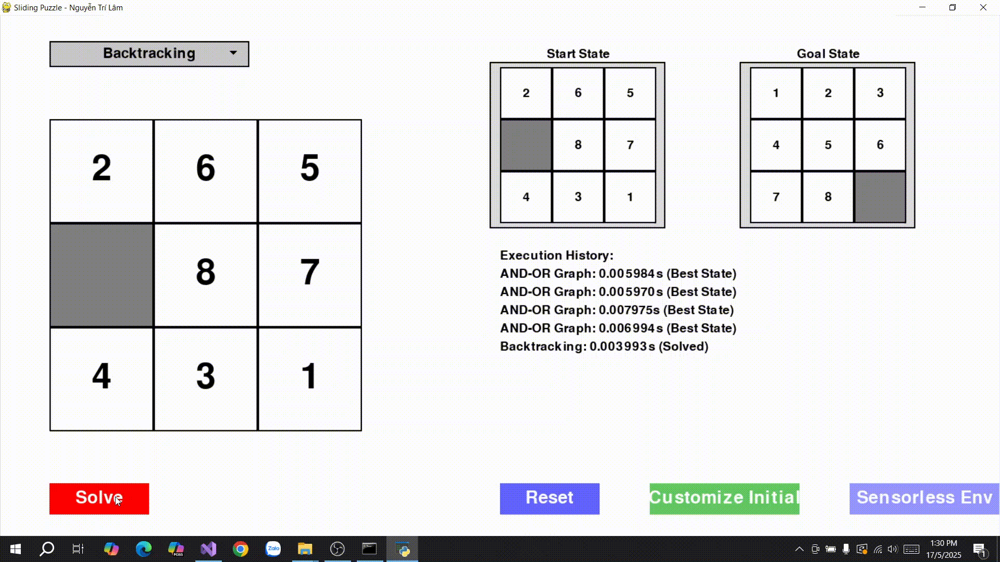 |
---
## Reinforcement Learning
---
### 1. **Khái niệm chung về Reinforcement Learning và Q-Learning**
- **Reinforcement Learning (RL)** là một phương pháp học máy, trong đó một tác nhân (agent) học cách đưa ra quyết định bằng cách thử và sai trong một môi trường động, nhằm tối đa hóa phần thưởng tích lũy (cumulative reward).
- **Q-Learning** là một thuật toán RL không dựa trên mô hình (model-free), thuộc nhóm **Temporal Difference (TD) Learning**, học một chính sách tối ưu thông qua việc ước lượng giá trị hành động (action-value function) mà không cần biết mô hình chuyển đổi trạng thái của môi trường.
- Mục tiêu của Q-Learning là tìm một chính sách (policy) ánh xạ từ trạng thái đến hành động, sao cho tối đa hóa phần thưởng dài hạn trong môi trường không xác định hoặc xác định.

---

### 2. **Các thành phần chính của Q-Learning**
- **Tác nhân (Agent)**: Thực thể đưa ra quyết định và học từ môi trường (ví dụ: tác nhân di chuyển ô trống trong 8-puzzle).
- **Môi trường (Environment)**: Không gian mà tác nhân tương tác, bao gồm tất cả trạng thái, hành động, và phần thưởng (ví dụ: lưới 3x3 của 8-puzzle với các trạng thái hoán vị).
- **Trạng thái (State, S)**: Một mô tả của môi trường tại một thời điểm (ví dụ: một hoán vị cụ thể của các ô trong 8-puzzle, như `[2, 6, 5, 0, 8, 7, 4, 3, 1]`).
- **Hành động (Action, A)**: Các lựa chọn mà tác nhân có thể thực hiện từ một trạng thái (ví dụ: di chuyển ô trống lên, xuống, trái, phải).
- **Phần thưởng (Reward, R)**: Phản hồi số từ môi trường sau mỗi hành động, định lượng mức độ tốt của hành động (ví dụ: +1 khi đạt trạng thái mục tiêu, -1 cho mỗi bước di chuyển, hoặc 0 nếu không đạt mục tiêu).
- **Chính sách (Policy, π)**: Chiến lược của tác nhân, ánh xạ từ trạng thái đến hành động (ví dụ: chọn hành động có giá trị Q cao nhất).
- **Hàm giá trị hành động (Q-Value, Q(s, a))**: Ước lượng phần thưởng tích lũy kỳ vọng khi thực hiện hành động `a` từ trạng thái `s` và theo chính sách tối ưu sau đó.
- **Mô hình chuyển đổi (Transition Model)**: Không cần thiết trong Q-Learning, vì thuật toán học trực tiếp từ kinh nghiệm (model-free).
- **Tỷ lệ học (Learning Rate, α)**: Quy định mức độ cập nhật giá trị Q sau mỗi kinh nghiệm (0 < α ≤ 1).
- **Hệ số chiết khấu (Discount Factor, γ)**: Quy định tầm quan trọng của phần thưởng tương lai so với phần thưởng hiện tại (0 ≤ γ ≤ 1).
- **Chiến lược khám phá (Exploration Strategy)**: Thường sử dụng **ε-greedy**, cân bằng giữa khám phá (exploration) và khai thác (exploitation) để thử các hành động mới hoặc chọn hành động tốt nhất.

---

### 3. **Giải pháp tổng quát của Q-Learning**

#### **Mô tả**
- Q-Learning học một hàm giá trị hành động \( Q(s, a) \) bằng cách cập nhật giá trị Q dựa trên phần thưởng nhận được và giá trị Q của trạng thái tiếp theo, sử dụng phương pháp **Temporal Difference (TD)**.
- Thuật toán không cần biết mô hình môi trường (chuyển đổi trạng thái hoặc phân phối phần thưởng), mà học trực tiếp từ các mẫu kinh nghiệm (state, action, reward, next state).
- Mục tiêu là tìm chính sách tối ưu \( \pi^*(s) = \arg\max_a Q^*(s, a) \), chọn hành động có giá trị Q cao nhất từ mỗi trạng thái.

#### **Cách hoạt động**
1. **Khởi tạo**:
   - Khởi tạo bảng Q (Q-table) với các giá trị ban đầu (thường là 0) cho tất cả cặp trạng thái-hành động \( (s, a) \).
   - Đặt các tham số: tỷ lệ học \( \alpha \), hệ số chiết khấu \( \gamma \), và tham số khám phá \( \varepsilon \) (cho chiến lược ε-greedy).

2. **Lặp qua các episode**:
   - Một episode là một chuỗi hành động từ trạng thái ban đầu đến trạng thái kết thúc (ví dụ: đạt trạng thái mục tiêu hoặc vượt quá số bước tối đa).
   - Trong mỗi episode:
     a. **Chọn hành động**:
        - Với xác suất \( \varepsilon \), chọn hành động ngẫu nhiên (khám phá).
        - Với xác suất \( 1 - \varepsilon \), chọn hành động có giá trị Q cao nhất: \( a = \arg\max_a Q(s, a) \) (khai thác).
     b. **Thực hiện hành động**:
        - Thực hiện hành động \( a \), nhận phần thưởng \( r \) và chuyển sang trạng thái tiếp theo \( s' \).
     c. **Cập nhật giá trị Q**:
        - Sử dụng công thức cập nhật Q-Learning:
          \[
          Q(s, a) \leftarrow Q(s, a) + \alpha \left[ r + \gamma \max_{a'} Q(s', a') - Q(s, a) \right]
          \]
          - \( r \): Phần thưởng nhận được.
          - \( \max_{a'} Q(s', a') \): Giá trị Q tối đa từ trạng thái tiếp theo.
          - \( \alpha \): Tỷ lệ học, điều chỉnh mức độ cập nhật.
          - \( \gamma \): Hệ số chiết khấu, cân nhắc phần thưởng tương lai.
     d. **Chuyển sang trạng thái tiếp theo**: Đặt \( s = s' \) và lặp lại cho đến khi episode kết thúc.

3. **Giảm khám phá**:
   - Giảm dần \( \varepsilon \) (ε-decay) để chuyển từ khám phá sang khai thác, giúp tác nhân tập trung vào chính sách tối ưu khi học đủ lâu.

4. **Kết thúc**:
   - Sau nhiều episode, bảng Q hội tụ đến \( Q^* \), biểu diễn giá trị hành động tối ưu.
   - Chính sách tối ưu được suy ra: \( \pi^*(s) = \arg\max_a Q^*(s, a) \).

#### **Đặc điểm**
- **Hoàn chỉnh**: Không đảm bảo hoàn chỉnh trong không gian trạng thái vô hạn hoặc nếu không khám phá đủ. Trong không gian hữu hạn (như 8-puzzle), Q-Learning hội tụ đến chính sách tối ưu nếu tất cả cặp trạng thái-hành động được thăm đủ nhiều lần.
- **Tối ưu**: Có, Q-Learning tìm chính sách tối ưu nếu hội tụ (với \( \alpha \) và \( \varepsilon \) được điều chỉnh phù hợp).
- **Độ phức tạp**:
  - **Thời gian**: Phụ thuộc vào số episode, số trạng thái \( |S| \), và số hành động \( |A| \). Trong trường hợp xấu, cần O(|S| * |A|) cập nhật cho mỗi episode.
  - **Không gian**: O(|S| * |A|) để lưu bảng Q.
- **Ứng dụng**:
  - Các bài toán điều khiển (robotics, trò chơi).
  - 8-puzzle với mục tiêu học cách di chuyển ô trống để đạt trạng thái mục tiêu.
  - Các môi trường có phần thưởng thưa thớt hoặc không xác định.

#### **Ví dụ trong 8-puzzle**
- **Trạng thái**: Một hoán vị của lưới 3x3 (ví dụ: `[1, 2, 3, 4, 0, 5, 6, 7, 8]`).
- **Hành động**: Di chuyển ô trống (lên, xuống, trái, phải).
- **Phần thưởng**:
  - +100 khi đạt trạng thái mục tiêu (`[1, 2, 3, 4, 5, 6, 7, 8, 0]`).
  - -1 cho mỗi bước di chuyển (khuyến khích đường đi ngắn).
  - 0 cho các trạng thái không phải mục tiêu.
- **Q-Learning**:
  - Tác nhân học bảng Q ánh xạ mỗi trạng thái-hành động đến giá trị kỳ vọng.
  - Sau khi học, chọn hành động \( \arg\max_a Q(s, a) \) từ mỗi trạng thái để đạt mục tiêu.

---

### 4. **Ưu điểm và nhược điểm**

#### **Ưu điểm**
- **Model-free**: Không cần biết mô hình chuyển đổi trạng thái, phù hợp với môi trường không xác định.
- **Học trực tiếp từ kinh nghiệm**: Dễ triển khai trong các môi trường phức tạp.
- **Chính sách tối ưu**: Hội tụ đến chính sách tối ưu nếu khám phá đủ.
- **Linh hoạt**: Áp dụng được cho nhiều bài toán, từ trò chơi đến điều khiển robot.

#### **Nhược điểm**
- **Hiệu suất chậm**: Yêu cầu nhiều episode để hội tụ, đặc biệt trong không gian trạng thái lớn (8-puzzle có 9!/2 ≈ 181,440 trạng thái).
- **Khám phá không hiệu quả**: Chiến lược ε-greedy có thể bỏ lỡ các trạng thái quan trọng trong không gian lớn.
- **Phần thưởng thưa thớt**: Trong 8-puzzle, nếu phần thưởng chỉ có khi đạt mục tiêu, việc học sẽ chậm.
- **Bảng Q lớn**: Trong các bài toán phức tạp, lưu trữ bảng Q tốn bộ nhớ, đặc biệt nếu \( |S| \) và \( |A| \) lớn.

---

### 5. **So sánh tổng quát**
| Thuật toán    | Hoàn chỉnh | Tối ưu | Độ phức tạp thời gian | Độ phức tạp không gian | Ứng dụng chính |
|---------------|------------|--------|-----------------------|------------------------|----------------|
| **Q-Learning** | Có (nếu khám phá đủ) | Có (khi hội tụ) | O(\|S\| * \|A\| * episodes) | O(\|S\| * \|A\|) | Trò chơi, robotics, 8-puzzle, điều khiển |

**Ghi chú**:
- **|S|**: Số trạng thái.
- **|A|**: Số hành động.
- **episodes**: Số vòng lặp học.

### 📷 **Hình ảnh thuật toán được áp dụng trong trò chơi**

| **Quá trình**             | **Minh Họa GIF**                                                |
|----------------------------|-----------------------------------------------------------------|
| **Học**           |   |
| **Giải**           | 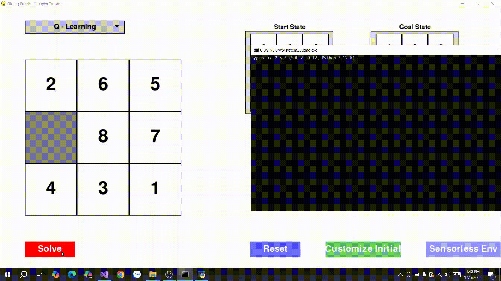 |

---
## 👨‍💻 Tác giả

**Nguyễn Trí Lâm**  
Trường: Sư phạm kỹ thuật TP.HCM
MSSV: `23110250`  
Môn: `Trí Tuệ Nhân Tạo`
Giáo viên hướng dẫn: `Phan Thị Huyền Trang` 

---
