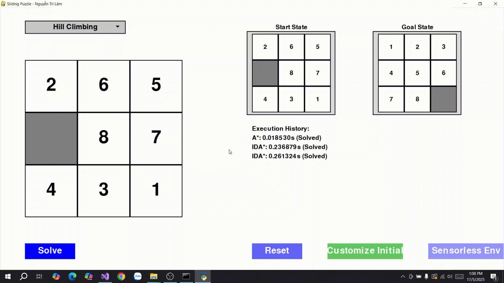

# 🔢 Đồ án cá nhân: 8-Puzzle Solver

## 🎯 Mục tiêu
Xây dựng một chương trình giải bài toán **8-Puzzle** sử dụng nhiều thuật toán tìm kiếm khác nhau trong lĩnh vực Trí tuệ nhân tạo.

---

## 🧠 Các thuật toán được triển khai
## Uninformed search algorithms

### 1. **Khái niệm chung về Uninformed Search Algorithms**
- **Uninformed Search** (tìm kiếm mù) là các thuật toán tìm kiếm không sử dụng thông tin heuristic (thông tin bổ sung về chi phí ước lượng đến mục tiêu). Chúng dựa vào cấu trúc của không gian tìm kiếm và các quy tắc cố định để khám phá các trạng thái.
- **Các thành phần chính**:
  - **Không gian trạng thái (State Space)**: Tập hợp tất cả các trạng thái có thể có của bài toán.
  - **Trạng thái ban đầu (Initial State)**: Điểm bắt đầu của bài toán.
  - **Trạng thái mục tiêu (Goal State)**: Trạng thái cần đạt được.
  - **Hành động (Actions)**: Các thao tác có thể thực hiện để chuyển từ trạng thái này sang trạng thái khác.
  - **Chi phí đường đi (Path Cost)**: Chi phí liên quan đến mỗi hành động hoặc đường đi (nếu có).
  - **Cấu trúc dữ liệu**: Thường sử dụng hàng đợi (queue), ngăn xếp (stack) hoặc hàng đợi ưu tiên (priority queue) để quản lý các trạng thái cần khám phá.

### 2. **Các thuật toán Uninformed Search**

#### a. **Breadth-First Search (BFS - Tìm kiếm theo chiều rộng)**
- **Mô tả**: Khám phá tất cả các trạng thái ở độ sâu hiện tại trước khi chuyển sang độ sâu tiếp theo. Sử dụng **hàng đợi (queue)** để lưu trữ các trạng thái.
- **Cách hoạt động**:
  1. Bắt đầu từ trạng thái ban đầu, thêm vào hàng đợi.
  2. Lấy trạng thái đầu tiên trong hàng đợi, kiểm tra xem có phải trạng thái mục tiêu không.
  3. Nếu không, sinh tất cả các trạng thái con (successors) và thêm chúng vào cuối hàng đợi.
  4. Lặp lại cho đến khi tìm thấy mục tiêu hoặc hàng đợi rỗng.
- **Đặc điểm**:
  - **Hoàn chỉnh (Complete)**: Tìm được giải pháp nếu tồn tại, với không gian trạng thái hữu hạn.
  - **Tối ưu (Optimal)**: Tìm đường đi ngắn nhất nếu chi phí hành động đồng nhất.
  - **Độ phức tạp**:
    - Thời gian: O(b^d), với b là số nhánh trung bình, d là độ sâu của giải pháp.
    - Không gian: O(b^d), do lưu trữ nhiều trạng thái ở mỗi mức.
- **Ứng dụng**: Tìm đường đi ngắn nhất trong đồ thị không trọng số, như mê cung.

#### b. **Depth-First Search (DFS - Tìm kiếm theo chiều sâu)**
- **Mô tả**: Khám phá trạng thái theo chiều sâu tối đa trước khi quay lại (backtrack). Sử dụng **ngăn xếp (stack)** hoặc đệ quy.
- **Cách hoạt động**:
  1. Bắt đầu từ trạng thái ban đầu, khám phá trạng thái con đầu tiên.
  2. Tiếp tục đi sâu vào một nhánh cho đến khi gặp ngõ cụt hoặc tìm thấy mục tiêu.
  3. Quay lại (backtrack) để khám phá các nhánh khác.
- **Đặc điểm**:
  - **Hoàn chỉnh**: Không đảm bảo trong không gian vô hạn hoặc có chu kỳ, trừ khi có cơ chế kiểm tra chu kỳ.
  - **Tối ưu**: Không tối ưu, vì có thể tìm đường đi dài hơn.
  - **Độ phức tạp**:
    - Thời gian: O(b^m), với m là độ sâu tối đa của không gian trạng thái.
    - Không gian: O(bm), do chỉ lưu một đường đi tại một thời điểm.
- **Ứng dụng**: Tìm kiếm trong không gian lớn, như giải câu đố, khi không cần đường đi tối ưu.

#### c. **Uniform Cost Search (UCS - Tìm kiếm chi phí đồng nhất)**
- **Mô tả**: Khám phá trạng thái theo chi phí đường đi tăng dần. Sử dụng **hàng đợi ưu tiên (priority queue)** dựa trên chi phí.
- **Cách hoạt động**:
  1. Bắt đầu từ trạng thái ban đầu, thêm vào hàng đợi ưu tiên với chi phí 0.
  2. Lấy trạng thái có chi phí thấp nhất từ hàng đợi, kiểm tra xem có phải mục tiêu không.
  3. Sinh các trạng thái con, tính chi phí đường đi từ gốc, thêm vào hàng đợi theo thứ tự chi phí.
  4. Lặp lại cho đến khi tìm thấy mục tiêu hoặc hàng đợi rỗng.
- **Đặc điểm**:
  - **Hoàn chỉnh**: Nếu chi phí hành động lớn hơn 0.
  - **Tối ưu**: Tìm đường đi có chi phí thấp nhất.
  - **Độ phức tạp**:
    - Thời gian: O(b^(C*/ε)), với C* là chi phí tối ưu, ε là chi phí hành động nhỏ nhất.
    - Không gian: O(b^(C*/ε)).
- **Ứng dụng**: Tìm đường đi tối ưu trong đồ thị có trọng số, như định tuyến đường đi.

#### d. **Iterative Deepening Search (IDS - Tìm kiếm sâu dần)**
- **Mô tả**: Kết hợp ưu điểm của BFS và DFS, thực hiện DFS với giới hạn độ sâu tăng dần.
- **Cách hoạt động**:
  1. Thực hiện DFS với giới hạn độ sâu (depth limit) là 0.
  2. Nếu không tìm thấy mục tiêu, tăng giới hạn độ sâu lên 1 và lặp lại.
  3. Tiếp tục tăng giới hạn độ sâu cho đến khi tìm thấy mục tiêu.
- **Đặc điểm**:
  - **Hoàn chỉnh**: Nếu không gian trạng thái hữu hạn.
  - **Tối ưu**: Tìm đường đi ngắn nhất nếu chi phí hành động đồng nhất.
  - **Độ phức tạp**:
    - Thời gian: O(b^d), tương tự BFS nhưng lặp lại nhiều lần.
    - Không gian: O(bd), tương tự DFS.
- **Ứng dụng**: Khi cần kết hợp ưu điểm của BFS (tối ưu) và DFS (tiết kiệm bộ nhớ).

### 3. **So sánh tổng quát**
| Thuật toán | Hoàn chỉnh | Tối ưu | Độ phức tạp thời gian | Độ phức tạp không gian | Ứng dụng chính |
|------------|------------|--------|-----------------------|------------------------|----------------|
| **BFS**    | Có (nếu hữu hạn) | Có (nếu chi phí đồng nhất) | O(b^d) | O(b^d) | Đường đi ngắn nhất (không trọng số) |
| **DFS**    | Không (nếu có chu kỳ) | Không | O(b^m) | O(bm) | Không gian lớn, không cần tối ưu |
| **UCS**    | Có (nếu chi phí > 0) | Có | O(b^(C*/ε)) | O(b^(C*/ε)) | Đường đi tối ưu (có trọng số) |
| **IDS**    | Có (nếu hữu hạn) | Có (nếu chi phí đồng nhất) | O(b^d) | O(bd) | Kết hợp BFS và DFS |

### 4. **Giải pháp tổng quát của Uninformed Search**
- **Quy trình chung**:
  1. Xác định trạng thái ban đầu và mục tiêu.
  2. Xây dựng không gian trạng thái và các hành động có thể thực hiện.
  3. Sử dụng cấu trúc dữ liệu (queue, stack, priority queue) để quản lý các trạng thái cần khám phá.
  4. Áp dụng chiến lược chọn trạng thái (theo chiều rộng, chiều sâu, chi phí, hoặc sâu dần) để tìm đường đi từ trạng thái ban đầu đến mục tiêu.
- **Ưu điểm**: Đơn giản, không cần thông tin bổ sung (heuristic), phù hợp với các bài toán không có thông tin về chi phí ước lượng.
- **Nhược điểm**: Hiệu quả thấp trong không gian trạng thái lớn hoặc phức tạp, đặc biệt khi không có heuristic hỗ trợ.

### 📷 **Hình ảnh các thuật toán được áp dụng trong trò chơi**
| **Thuật Toán**                  | **Minh Họa GIF**                                  |
|----------------------------------|---------------------------------------------------|
| **Breadth-First Search (BFS)**  |   |
| **Depth-First Search (DFS)**    |                |
| **Uniform Cost Search (UCS)**   |                |
| **Iterative Deepening Search (IDS)** |          |

### 🔍 So sánh các thuật toán tìm kiếm không thông tin (Uninformed Search Algorithms)

| **Thuật toán** | **Hoàn chỉnh** | **Tối ưu** | **Bộ nhớ**       | **Thời gian**     | **Phù hợp với 8-puzzle**                                   |
|----------------|----------------|------------|------------------|-------------------|-------------------------------------------------------------|
| **BFS**        | Có             | Có         | Cao `O(b^d)`     | Cao `O(b^d)`      | ✔ Phù hợp nếu lời giải nông, nhưng tiêu tốn nhiều bộ nhớ    |
| **DFS**        | Không          | Không      | Thấp `O(bm)`     | Biến động `O(b^m)`| ❌ Không phù hợp, dễ bị kẹt và không tối ưu                 |
| **UCS**        | Có             | Có         | Cao `O(b^d)`     | Cao `O(b^d)`      | ✔ Tìm giải pháp tối ưu, nhưng tốn tài nguyên               |
| **IDS**        | Có             | Có         | Thấp `O(bd)`     | Cao `O(b^d)`      | ✔ Thích hợp khi bộ nhớ hạn chế, nhưng chậm hơn BFS          |

**Chú thích:**
- `b`: số nhánh trung bình (branching factor)
- `d`: độ sâu của lời giải tối ưu
- `m`: độ sâu tối đa của cây tìm kiếm

### 📝 Nhận xét chung:

Các thuật toán tìm kiếm không thông tin (Uninformed Search) đều không có kiến thức cụ thể về vị trí đích, do đó phải **duyệt toàn bộ không gian trạng thái một cách mù mờ**. Mỗi thuật toán có đặc điểm riêng:

* **BFS** thích hợp khi lời giải nằm ở độ sâu nhỏ, đảm bảo tìm được lời giải ngắn nhất nhưng **tốn nhiều bộ nhớ**.
* **DFS** có ưu điểm tiết kiệm bộ nhớ, nhưng **dễ rơi vào vòng lặp vô tận** và không đảm bảo tối ưu.
* **UCS** mở rộng BFS bằng cách tính đến chi phí, cho phép tìm lời giải tối ưu khi chi phí không đồng đều, nhưng **hiệu năng giảm nếu không gian tìm kiếm lớn**.
* **IDS** kết hợp ưu điểm của BFS và DFS: đảm bảo tối ưu, tiết kiệm bộ nhớ, nhưng **thời gian chạy lâu hơn do phải lặp lại nhiều lần**.

Với bài toán như **8-puzzle**, nơi không gian trạng thái lớn và cần lời giải tối ưu, **BFS, UCS hoặc IDS** là lựa chọn phù hợp. Tuy nhiên, khi bộ nhớ hạn chế, **IDS** thường là phương án an toàn hơn.

## Informed Search Algorithms

### 1. **Khái niệm chung về Informed Search Algorithms**
- **Informed Search** (tìm kiếm có thông tin) sử dụng **hàm heuristic** để ước lượng chi phí từ trạng thái hiện tại đến trạng thái mục tiêu, giúp định hướng tìm kiếm hiệu quả hơn so với Uninformed Search (BFS, DFS, UCS, IDS).
- **Các thành phần chính**:
  - **Không gian trạng thái (State Space)**: Tập hợp tất cả các trạng thái có thể có của bài toán (ví dụ: các hoán vị của ô trong 8-puzzle).
  - **Trạng thái ban đầu (Initial State)**: Điểm xuất phát của bài toán.
  - **Trạng thái mục tiêu (Goal State)**: Trạng thái cần đạt được.
  - **Hành động (Actions)**: Các thao tác hợp lệ để chuyển đổi giữa các trạng thái (ví dụ: di chuyển ô trống lên, xuống, trái, phải).
  - **Chi phí đường đi (Path Cost, g(n))**: Tổng chi phí từ trạng thái ban đầu đến trạng thái hiện tại (thường là số bước hoặc chi phí cụ thể của hành động).
  - **Hàm heuristic (h(n))**: Hàm ước lượng chi phí từ trạng thái hiện tại đến mục tiêu. Hàm này phải **admissible** (không overestimated) và lý tưởng là **consistent** (đáp ứng bất đẳng thức tam giác) để đảm bảo tính tối ưu.
  - **Cấu trúc dữ liệu**: Thường sử dụng hàng đợi ưu tiên (priority queue) để ưu tiên trạng thái có chi phí thấp nhất hoặc giá trị heuristic nhỏ nhất.

### 2. **Các thuật toán Informed Search**

#### a. **A* Search**
- **Mô tả**: A* sử dụng hàm đánh giá **f(n) = g(n) + h(n)**:
  - **g(n)**: Chi phí thực tế từ trạng thái ban đầu đến trạng thái hiện tại.
  - **h(n)**: Chi phí ước lượng từ trạng thái hiện tại đến mục tiêu (ví dụ: khoảng cách Manhattan trong 8-puzzle).
  - A* ưu tiên khám phá trạng thái có **f(n)** nhỏ nhất, đảm bảo đường đi tối ưu nếu heuristic là admissible.
- **Cách hoạt động**:
  1. Bắt đầu từ trạng thái ban đầu, thêm vào hàng đợi ưu tiên với chi phí `f(n) = g(n) + h(n)`.
  2. Lấy trạng thái có `f(n)` nhỏ nhất từ hàng đợi, kiểm tra xem có phải trạng thái mục tiêu không.
  3. Sinh các trạng thái con, tính `g(n)` và `h(n)` cho mỗi trạng thái, thêm vào hàng đợi.
  4. Lặp lại cho đến khi tìm thấy mục tiêu hoặc hàng đợi rỗng.
- **Đặc điểm**:
  - **Hoàn chỉnh**: Có, nếu không gian trạng thái hữu hạn và chi phí hành động lớn hơn 0.
  - **Tối ưu**: Có, nếu heuristic là admissible (h(n) ≤ chi phí thực tế đến mục tiêu).
  - **Độ phức tạp**:
    - Thời gian: O(b^d), nhưng thường nhanh hơn BFS/UCS nhờ heuristic định hướng.
    - Không gian: O(b^d), do lưu trữ nhiều trạng thái trong hàng đợi ưu tiên.
- **Ứng dụng**: Tìm đường đi tối ưu trong các bài toán như 8-puzzle, định tuyến, hoặc lập kế hoạch, khi cần đảm bảo chi phí thấp nhất.

#### b. **Iterative Deepening A* (IDA*)**
- **Mô tả**: IDA* kết hợp ý tưởng của A* và Iterative Deepening Search (IDS). Nó sử dụng hàm `f(n) = g(n) + h(n)` nhưng giới hạn tìm kiếm theo ngưỡng `f(n)` tăng dần, thực hiện tìm kiếm theo chiều sâu (DFS) trong mỗi lần lặp.
- **Cách hoạt động**:
  1. Bắt đầu với ngưỡng ban đầu là `f(n) = h(n)` của trạng thái ban đầu.
  2. Thực hiện DFS, chỉ khám phá các trạng thái có `f(n)` ≤ ngưỡng.
  3. Nếu không tìm thấy mục tiêu, tăng ngưỡng lên giá trị `f(n)` nhỏ nhất vượt ngưỡng hiện tại, lặp lại.
  4. Tiếp tục cho đến khi tìm thấy mục tiêu hoặc không còn trạng thái để khám phá.
- **Đặc điểm**:
  - **Hoàn chỉnh**: Có, nếu không gian trạng thái hữu hạn.
  - **Tối ưu**: Có, nếu heuristic là admissible.
  - **Độ phức tạp**:
    - Thời gian: O(b^d), nhưng có thể chậm hơn A* do lặp lại nhiều lần.
    - Không gian: O(bd), tiết kiệm bộ nhớ hơn A* vì chỉ lưu một đường đi tại mỗi lần lặp.
- **Ứng dụng**: Phù hợp cho các bài toán như 8-puzzle khi bộ nhớ hạn chế, nhưng cần giải pháp tối ưu.

#### c. **Greedy Best-First Search (Greedy)**
- **Mô tả**: Greedy ưu tiên khám phá trạng thái có giá trị **heuristic h(n)** nhỏ nhất, bỏ qua chi phí đường đi `g(n)`. Nó tập trung vào việc tiến gần trạng thái mục tiêu nhanh nhất có thể.
- **Cách hoạt động**:
  1. Bắt đầu từ trạng thái ban đầu, thêm vào hàng đợi ưu tiên với giá trị `h(n)`.
  2. Lấy trạng thái có `h(n)` nhỏ nhất, kiểm tra xem có phải mục tiêu không.
  3. Sinh các trạng thái con, tính `h(n)` cho mỗi trạng thái, thêm vào hàng đợi.
  4. Lặp lại cho đến khi tìm thấy mục tiêu hoặc hàng đợi rỗng.
- **Đặc điểm**:
  - **Hoàn chỉnh**: Không, có thể bị kẹt trong các vòng lặp hoặc bỏ sót giải pháp.
  - **Tối ưu**: Không, vì không xem xét chi phí đường đi `g(n)`, có thể dẫn đến đường đi dài hơn.
  - **Độ phức tạp**:
    - Thời gian: O(b^m), với m là độ sâu tối đa, nhưng thường nhanh hơn A* do chỉ dựa vào `h(n)`.
    - Không gian: O(b^m), tùy thuộc vào số trạng thái được lưu trữ.
- **Ứng dụng**: Dùng khi cần tìm giải pháp nhanh, không yêu cầu tối ưu, như trong một số bài toán tìm kiếm đơn giản hoặc khi thời gian thực thi là ưu tiên.

---

### 3. **So sánh tổng quát**
| Thuật toán | Hoàn chỉnh | Tối ưu | Độ phức tạp thời gian | Độ phức tạp không gian | Ứng dụng chính |
|------------|------------|--------|-----------------------|------------------------|----------------|
| **A***     | Có         | Có     | O(b^d)               | O(b^d)                | Tìm đường đi tối ưu (8-puzzle, định tuyến) |
| **IDA***   | Có         | Có     | O(b^d)               | O(bd)                 | Tìm đường đi tối ưu, tiết kiệm bộ nhớ |
| **Greedy** | Không      | Không  | O(b^m)               | O(b^m)                | Tìm giải pháp nhanh, không cần tối ưu |

---

### 4. **Giải pháp tổng quát của Informed Search**
- **Quy trình chung**:
  1. Xác định trạng thái ban đầu, trạng thái mục tiêu, và các hành động có thể thực hiện.
  2. Xây dựng hàm heuristic (ví dụ: khoảng cách Manhattan cho 8-puzzle) để ước lượng chi phí.
  3. Sử dụng hàng đợi ưu tiên hoặc chiến lược DFS với ngưỡng để quản lý các trạng thái cần khám phá.
  4. Áp dụng chiến lược chọn trạng thái:
     - **A***: Dựa trên `f(n) = g(n) + h(n)`.
     - **IDA***: DFS với ngưỡng `f(n)` tăng dần.
     - **Greedy**: Dựa trên `h(n)` nhỏ nhất.
  5. Tìm đường đi từ trạng thái ban đầu đến mục tiêu, ưu tiên các trạng thái có chi phí hoặc heuristic thấp.
- **Ưu điểm**:
  - Hiệu quả hơn Uninformed Search nhờ heuristic định hướng.
  - A* và IDA* đảm bảo tối ưu nếu heuristic là admissible.
  - IDA* tiết kiệm bộ nhớ, phù hợp cho các bài toán lớn.
  - Greedy nhanh, phù hợp khi không cần tối ưu.
- **Nhược điểm**:
  - A* tốn bộ nhớ do lưu trữ nhiều trạng thái.
  - IDA* có thể chậm do lặp lại nhiều lần.
  - Greedy không đảm bảo hoàn chỉnh hoặc tối ưu, dễ bị kẹt trong các cực trị cục bộ.
- **Yêu cầu**:
  - Cần thiết kế hàm heuristic phù hợp (admissible và consistent cho A* và IDA*).
  - Kiểm tra chu kỳ hoặc trạng thái lặp để tránh vòng lặp vô hạn.

### 📷 **Hình ảnh các thuật toán được áp dụng trong trò chơi**
| **Thuật Toán**                       | **Minh Họa GIF**                                      |
|-------------------------------------|-------------------------------------------------------|
| **A\* Search (A-Star)**             |      |
| **Iterative Deepening A\* (IDA\*)** | |
| **Greedy Best-First Search**        | |

### 🔍 So sánh các thuật toán tìm kiếm có thông tin (Informed Search Algorithms)

| **Thuật Toán**        | **Hoàn chỉnh** | **Tối ưu** | **Độ phức tạp thời gian** | **Độ phức tạp không gian** | **Hiệu suất trong 8-puzzle**                                                                   | **Ưu điểm**                                       | **Nhược điểm**                                          |
| --------------------- | -------------- | ---------- | ------------------------- | -------------------------- | ---------------------------------------------------------------------------------------------- | ------------------------------------------------- | ------------------------------------------------------- |
| **A\***               | Có             | Có         | `O(b^d)`                  | `O(b^d)`                   | ✔ Hiệu quả cao, tìm đường đi ngắn nhất nhanh hơn BFS/UCS nhờ heuristic. Phù hợp khi đủ bộ nhớ. | ✅ Tối ưu, hoàn chỉnh, nhanh hơn Uninformed Search | ❌ Tốn nhiều bộ nhớ, giảm hiệu suất với độ sâu lớn (>20) |
| **IDA\***             | Có             | Có         | `O(b^d)`                  | `O(bd)`                    | ✔ Tiết kiệm bộ nhớ, phù hợp cho hệ thống hạn chế tài nguyên. Chậm hơn A\* ở độ sâu lớn.        | ✅ Tối ưu, tiết kiệm bộ nhớ                        | ❌ Chậm hơn A\* do phải lặp lại nhiều lần                |
| **Greedy Best-First** | Không          | Không      | `O(b^m)`                  | `O(b^m)`                   | ✔ Nhanh, nhưng dễ bị kẹt hoặc tìm đường không tối ưu. Phù hợp khi cần kết quả nhanh.           | ✅ Nhanh, đơn giản                                 | ❌ Không tối ưu, có thể bỏ sót lời giải tốt hơn          |

### **Chú thích:**
* `b`: Số nhánh trung bình (trong 8-puzzle, thường ≈ 2–4 tùy vị trí ô trống).
* `d`: Độ sâu của lời giải tối ưu.
* `m`: Độ sâu tối đa của không gian trạng thái.
* **Heuristic sử dụng**: *Khoảng cách Manhattan* là heuristic **admissible** và **consistent**, đảm bảo tính tối ưu cho thuật toán **A\*** và **IDA\***.

### 📝 **Nhận xét chung:**

Các thuật toán **tìm kiếm có thông tin (Informed Search)** như **A\***, **IDA\*** và **Greedy Best-First Search** tận dụng heuristic để hướng dẫn quá trình tìm kiếm hiệu quả hơn so với các thuật toán không thông tin.

* **A\*** là lựa chọn **tối ưu nhất** nếu hệ thống có đủ bộ nhớ, nhờ vào tính chất tối ưu và nhanh nhờ sử dụng heuristic tốt (ví dụ: Manhattan).
* **IDA\*** phù hợp cho các môi trường **hạn chế tài nguyên** (như thiết bị nhúng, bộ nhớ thấp), vẫn đảm bảo tối ưu nhưng **hy sinh tốc độ** vì phải lặp lại nhiều lần.
* **Greedy Best-First Search** hoạt động **nhanh và đơn giản**, tuy nhiên **thiếu tính tối ưu**, dễ rơi vào bẫy cục bộ (local minima) nếu heuristic không tốt.

👉 **Tóm lại**:

* Nếu **ưu tiên chất lượng lời giải** và **có đủ tài nguyên**, hãy chọn **A\***.
* Nếu **ưu tiên tiết kiệm bộ nhớ**, chọn **IDA\***.
* Nếu **cần kết quả nhanh** và **không quá quan tâm tối ưu**, có thể thử **Greedy**.

## Local Search Algorithms

### 1. **Khái niệm chung về Local Search Algorithms**
- **Local Search** (tìm kiếm cục bộ) tập trung vào việc cải thiện một giải pháp hiện tại bằng cách khám phá các trạng thái lân cận, thay vì khám phá toàn bộ không gian trạng thái như các thuật toán Informed/Uninformed Search.
- Không duy trì một cây tìm kiếm hoặc hàng đợi các trạng thái, mà chỉ làm việc với trạng thái hiện tại và các trạng thái lân cận của nó.
- Thường sử dụng trong các bài toán tối ưu, khi không gian trạng thái lớn và mục tiêu là tìm giải pháp tốt (không nhất thiết tối ưu toàn cục).
- **Các thành phần chính**:
  - **Không gian trạng thái (State Space)**: Tập hợp tất cả các trạng thái có thể có (ví dụ: các hoán vị của ô trong 8-puzzle).
  - **Trạng thái ban đầu (Initial State)**: Một giải pháp khởi đầu, thường được chọn ngẫu nhiên hoặc cố định.
  - **Trạng thái mục tiêu (Goal State)**: Trạng thái lý tưởng hoặc tiêu chí tối ưu (ví dụ: trạng thái mục tiêu trong 8-puzzle hoặc giá trị hàm mục tiêu tối ưu).
  - **Hành động (Actions)**: Các thao tác để chuyển từ trạng thái hiện tại sang trạng thái lân cận (ví dụ: di chuyển ô trống trong 8-puzzle).
  - **Hàm mục tiêu (Objective Function)**: Đánh giá chất lượng của trạng thái, thường là hàm heuristic (như khoảng cách Manhattan) hoặc một hàm đánh giá khác. Trong tối ưu, có thể là tối thiểu hóa hoặc tối đa hóa giá trị hàm.
  - **Lân cận (Neighborhood)**: Tập hợp các trạng thái có thể đạt được từ trạng thái hiện tại bằng một hành động.

---

### 2. **Các thuật toán Local Search**

#### a. **Simple Hill Climbing**
- **Mô tả**: Chọn trạng thái lân cận đầu tiên có giá trị hàm mục tiêu tốt hơn trạng thái hiện tại (tối ưu hóa cục bộ).
- **Cách hoạt động**:
  1. Bắt đầu từ trạng thái ban đầu.
  2. Đánh giá các trạng thái lân cận, chọn trạng thái đầu tiên có giá trị hàm mục tiêu tốt hơn (ví dụ: khoảng cách Manhattan nhỏ hơn).
  3. Chuyển sang trạng thái lân cận đó, lặp lại cho đến khi không tìm thấy trạng thái lân cận nào tốt hơn (đỉnh cục bộ).
- **Đặc điểm**:
  - **Hoàn chỉnh**: Không, dễ bị kẹt ở cực trị cục bộ.
  - **Tối ưu**: Không, chỉ tìm giải pháp cục bộ.
  - **Độ phức tạp**:
    - Thời gian: Phụ thuộc vào số lân cận và số lần lặp, thường thấp (O(k) mỗi bước, với k là số lân cận).
    - Không gian: O(1), chỉ lưu trạng thái hiện tại và lân cận.
- **Ứng dụng**: Tìm giải pháp nhanh trong các bài toán như 8-puzzle, tối ưu hóa hàm đơn giản.

#### b. **Steepest-Ascent Hill Climbing**
- **Mô tả**: Xem xét tất cả các trạng thái lân cận và chọn trạng thái có giá trị hàm mục tiêu tốt nhất (tối ưu hóa cục bộ).
- **Cách hoạt động**:
  1. Bắt đầu từ trạng thái ban đầu.
  2. Đánh giá tất cả các trạng thái lân cận, chọn trạng thái có giá trị hàm mục tiêu tốt nhất (ví dụ: khoảng cách Manhattan nhỏ nhất).
  3. Chuyển sang trạng thái tốt nhất, lặp lại cho đến khi không có trạng thái lân cận nào tốt hơn.
- **Đặc điểm**:
  - **Hoàn chỉnh**: Không, có thể bị kẹt ở cực trị cục bộ.
  - **Tối ưu**: Không, nhưng thường tốt hơn Simple Hill Climbing do chọn trạng thái lân cận tốt nhất.
  - **Độ phức tạp**:
    - Thời gian: O(k) mỗi bước, với k là số lân cận, nhưng tốn thời gian hơn Simple Hill Climbing do đánh giá tất cả lân cận.
    - Không gian: O(k), để lưu danh sách lân cận.
- **Ứng dụng**: Phù hợp cho các bài toán như 8-puzzle khi cần cải thiện chất lượng giải pháp so với Simple Hill Climbing.

#### c. **Stochastic Hill Climbing**
- **Mô tả**: Chọn ngẫu nhiên một trạng thái lân cận có giá trị hàm mục tiêu tốt hơn trạng thái hiện tại, thay vì chọn trạng thái tốt nhất.
- **Cách hoạt động**:
  1. Bắt đầu từ trạng thái ban đầu.
  2. Tạo danh sách các trạng thái lân cận tốt hơn trạng thái hiện tại (dựa trên hàm mục tiêu).
  3. Chọn ngẫu nhiên một trạng thái từ danh sách đó, chuyển sang trạng thái này.
  4. Lặp lại cho đến khi không có trạng thái lân cận nào tốt hơn.
- **Đặc điểm**:
  - **Hoàn chỉnh**: Không, vẫn có thể bị kẹt ở cực trị cục bộ.
  - **Tối ưu**: Không, nhưng tính ngẫu nhiên giúp tránh một số cực trị cục bộ so với Simple/Steepest Hill Climbing.
  - **Độ phức tạp**:
    - Thời gian: O(k) mỗi bước, nhưng có thể nhanh hơn Steepest do không cần đánh giá tất cả lân cận.
    - Không gian: O(k), để lưu danh sách lân cận tốt hơn.
- **Ứng dụng**: Dùng khi muốn cân bằng giữa tốc độ và khả năng thoát khỏi cực trị cục bộ, như trong 8-puzzle hoặc bài toán tối ưu hóa.

#### d. **Simulated Annealing**
- **Mô tả**: Kết hợp tìm kiếm cục bộ với cơ chế ngẫu nhiên để thoát khỏi cực trị cục bộ, sử dụng khái niệm "nhiệt độ" (temperature) để điều khiển mức độ chấp nhận các trạng thái xấu hơn.
- **Cách hoạt động**:
  1. Bắt đầu từ trạng thái ban đầu, thiết lập nhiệt độ ban đầu cao và tốc độ giảm nhiệt độ (cooling rate).
  2. Chọn ngẫu nhiên một trạng thái lân cận.
  3. Chấp nhận trạng thái lân cận nếu:
     - Nó tốt hơn trạng thái hiện tại (theo hàm mục tiêu).
     - Hoặc, nếu xấu hơn, chấp nhận với xác suất `exp(-ΔE/T)`, với `ΔE` là độ chênh lệch hàm mục tiêu và `T` là nhiệt độ.
  4. Giảm nhiệt độ dần theo lịch trình (thường là `T = T * cooling_rate`).
  5. Lặp lại cho đến khi nhiệt độ đạt ngưỡng tối thiểu hoặc tìm được giải pháp đủ tốt.
- **Đặc điểm**:
  - **Hoàn chỉnh**: Không, nhưng có thể tìm giải pháp tốt nếu điều chỉnh lịch trình nhiệt độ phù hợp.
  - **Tối ưu**: Không, nhưng có khả năng thoát khỏi cực trị cục bộ, tiến gần giải pháp toàn cục.
  - **Độ phức tạp**:
    - Thời gian: Phụ thuộc vào số lần lặp và lịch trình nhiệt độ, thường cao hơn Hill Climbing.
    - Không gian: O(1), chỉ lưu trạng thái hiện tại và lân cận.
- **Ứng dụng**: Phù hợp cho các bài toán tối ưu phức tạp như 8-puzzle, lập lịch, hoặc tối ưu hóa hàm với nhiều cực trị cục bộ.

#### e. **Local Beam Search**
- **Mô tả**: Duy trì một tập hợp `k` trạng thái tốt nhất (beam) và mở rộng chúng, thay vì chỉ làm việc với một trạng thái như Hill Climbing.
- **Cách hoạt động**:
  1. Bắt đầu với `k` trạng thái ban đầu (thường chọn ngẫu nhiên).
  2. Tạo tất cả các trạng thái lân cận từ `k` trạng thái hiện tại.
  3. Chọn `k` trạng thái lân cận tốt nhất (dựa trên hàm mục tiêu).
  4. Lặp lại cho đến khi đạt trạng thái mục tiêu hoặc không cải thiện được thêm.
- **Đặc điểm**:
  - **Hoàn chỉnh**: Không, có thể bỏ sót giải pháp nếu beam không chứa trạng thái dẫn đến mục tiêu.
  - **Tối ưu**: Không, nhưng thường tìm được giải pháp tốt hơn Hill Climbing do khám phá nhiều trạng thái cùng lúc.
  - **Độ phức tạp**:
    - Thời gian: O(kb) mỗi bước, với b là số nhánh trung bình và k là kích thước beam.
    - Không gian: O(k), để lưu `k` trạng thái.
- **Ứng dụng**: Dùng trong các bài toán như 8-puzzle, khi cần cân bằng giữa khám phá nhiều trạng thái và tiết kiệm tài nguyên.

#### f. **Genetic Algorithm**
- **Mô tả**: Dựa trên cơ chế tiến hóa, duy trì một tập hợp các giải pháp (population) và cải thiện chúng qua các thế hệ bằng cách sử dụng **crossover**, **mutation**, và **selection**.
- **Cách hoạt động**:
  1. Khởi tạo một tập hợp các giải pháp ngẫu nhiên (population).
  2. Đánh giá chất lượng mỗi giải pháp bằng hàm mục tiêu (fitness function).
  3. Chọn các giải pháp tốt (selection) để tạo thế hệ mới thông qua:
     - **Crossover**: Kết hợp hai giải pháp để tạo giải pháp mới.
     - **Mutation**: Thay đổi ngẫu nhiên một phần của giải pháp để tăng tính đa dạng.
  4. Lặp lại qua nhiều thế hệ cho đến khi tìm được giải pháp đủ tốt hoặc đạt số thế hệ tối đa.
- **Đặc điểm**:
  - **Hoàn chỉnh**: Không, nhưng có thể tìm giải pháp tốt nếu điều chỉnh tham số hợp lý.
  - **Tối ưu**: Không, nhưng có khả năng tiến gần giải pháp toàn cục nhờ tính đa dạng của population.
  - **Độ phức tạp**:
    - Thời gian: Phụ thuộc vào kích thước population, số thế hệ, và chi phí đánh giá hàm mục tiêu.
    - Không gian: O(p), với p là kích thước population.
- **Ứng dụng**: Phù hợp cho các bài toán tối ưu hóa phức tạp như 8-puzzle, thiết kế, hoặc lập lịch, khi không gian trạng thái rất lớn.

---

### 3. **So sánh tổng quát**
| Thuật toán                     | Hoàn chỉnh | Tối ưu | Độ phức tạp thời gian | Độ phức tạp không gian | Ứng dụng chính |
|-------------------------------|------------|--------|-----------------------|------------------------|----------------|
| **Simple Hill Climbing**      | Không      | Không  | O(k) mỗi bước        | O(1)                  | Tìm giải pháp nhanh, đơn giản |
| **Steepest-Ascent Hill Climbing** | Không      | Không  | O(k) mỗi bước        | O(k)                  | Cải thiện giải pháp cục bộ |
| **Stochastic Hill Climbing**  | Không      | Không  | O(k) mỗi bước        | O(k)                  | Tránh cực trị cục bộ nhẹ |
| **Simulated Annealing**       | Không      | Không  | Phụ thuộc lịch trình | O(1)                  | Thoát cực trị cục bộ, tối ưu hóa |
| **Local Beam Search**         | Không      | Không  | O(kb) mỗi bước       | O(k)                  | Khám phá nhiều trạng thái |
| **Genetic Algorithm**         | Không      | Không  | Phụ thuộc population  | O(p)                  | Tối ưu hóa không gian lớn |

---

### 4. **Giải pháp tổng quát của Local Search**
- **Quy trình chung**:
  1. Chọn một trạng thái ban đầu (ngẫu nhiên hoặc cố định).
  2. Xác định hàm mục tiêu (ví dụ: khoảng cách Manhattan trong 8-puzzle) để đánh giá chất lượng trạng thái.
  3. Tạo và đánh giá các trạng thái lân cận, chọn hoặc chấp nhận trạng thái tiếp theo dựa trên chiến lược:
     - **Simple Hill Climbing**: Chọn trạng thái lân cận đầu tiên tốt hơn.
     - **Steepest-Ascent Hill Climbing**: Chọn trạng thái lân cận tốt nhất.
     - **Stochastic Hill Climbing**: Chọn ngẫu nhiên trạng thái lân cận tốt hơn.
     - **Simulated Annealing**: Chấp nhận trạng thái lân cận dựa trên xác suất liên quan đến nhiệt độ.
     - **Local Beam Search**: Duy trì và mở rộng `k` trạng thái tốt nhất.
     - **Genetic Algorithm**: Tiến hóa một tập hợp giải pháp qua selection, crossover, mutation.
  4. Lặp lại cho đến khi đạt trạng thái mục tiêu, cực trị cục bộ, hoặc giới hạn tài nguyên (thời gian, số bước).
- **Ưu điểm**:
  - Tiết kiệm bộ nhớ, vì chỉ làm việc với trạng thái hiện tại hoặc một tập nhỏ trạng thái.
  - Nhanh, đặc biệt khi không cần giải pháp tối ưu toàn cục.
  - Phù hợp cho không gian trạng thái lớn, như 8-puzzle, khi khám phá toàn bộ không khả thi.
- **Nhược điểm**:
  - Không đảm bảo hoàn chỉnh hoặc tối ưu, dễ bị kẹt ở cực trị cục bộ (trừ Simulated Annealing và Genetic Algorithm, có khả năng thoát cục bộ).
  - Hiệu quả phụ thuộc vào hàm mục tiêu và cách định nghĩa lân cận.
- **Yêu cầu**:
  - Hàm mục tiêu hiệu quả, phản ánh đúng chất lượng giải pháp.
  - Cơ chế thoát khỏi cực trị cục bộ (như ngẫu nhiên hóa hoặc lịch trình nhiệt độ).
  - Điều chỉnh tham số (nhiệt độ, kích thước beam, population, v.v.) để cân bằng giữa chất lượng và hiệu suất.
    
### 📷 **Hình ảnh các thuật toán được áp dụng trong trò chơi**

| **Thuật Toán**                           | **Minh Họa GIF**                                           |
|-----------------------------------------|------------------------------------------------------------|
| **Simple Hill Climbing**                |  |
| **Steepest-Ascent Hill Climbing**       |  |
| **Stochastic Hill Climbing**            |  |
| **Simulated Annealing**                 |  |
| **Local Beam Search**                   |  |
| **Genetic Algorithm**                   |  |

Dưới đây là phiên bản được **kẻ lại dưới dạng bảng Markdown** cho phần **"2. Bảng so sánh hiệu suất các thuật toán trong 8-puzzle"** với các **thuật toán tìm kiếm cục bộ (local search)**. Bạn có thể chép trực tiếp vào file `README.md`:

---

### 🔍 So sánh các thuật toán tìm kiếm cục bộ (Local Search Algorithms)

| **Thuật Toán**                    | **Hoàn chỉnh** | **Tối ưu** | **Độ phức tạp thời gian**     | **Độ phức tạp không gian** | **Hiệu suất trong 8-puzzle**                                                          | **Ưu điểm**                                   | **Nhược điểm**                                       |
| --------------------------------- | -------------- | ---------- | ----------------------------- | -------------------------- | ------------------------------------------------------------------------------------- | --------------------------------------------- | ---------------------------------------------------- |
| **Simple Hill Climbing**          | Không          | Không      | `O(k)` mỗi bước               | `O(1)`                     | Nhanh, nhưng dễ kẹt ở cực trị cục bộ, kém hiệu quả khi cách xa mục tiêu.              | ✅ Nhanh, tiết kiệm bộ nhớ                     | ❌ Dễ kẹt, không đảm bảo tìm được lời giải tốt        |
| **Steepest-Ascent Hill Climbing** | Không          | Không      | `O(k)` mỗi bước               | `O(k)`                     | Tốt hơn Simple, nhưng vẫn dễ kẹt ở cực trị cục bộ.                                    | ✅ Chọn lân cận tốt nhất, cải thiện chất lượng | ❌ Tốn thời gian hơn Simple, vẫn không đảm bảo tối ưu |
| **Stochastic Hill Climbing**      | Không          | Không      | `O(k)` mỗi bước               | `O(k)`                     | Nhanh hơn Steepest, tránh được một số cực trị cục bộ.                                 | ✅ Ngẫu nhiên, nhanh                           | ❌ Vẫn dễ kẹt, không tối ưu                           |
| **Simulated Annealing**           | Không          | Không      | Phụ thuộc lịch trình          | `O(1)`                     | Có thể thoát cực trị cục bộ, hiệu quả với trạng thái xa mục tiêu nếu tham số phù hợp. | ✅ Thoát cực trị cục bộ, tiết kiệm bộ nhớ      | ❌ Phụ thuộc tham số, tốc độ không ổn định            |
| **Local Beam Search**             | Không          | Không      | `O(kb)` mỗi bước              | `O(k)`                     | Tốt hơn Hill Climbing, nhưng phụ thuộc nhiều vào `beam_width`.                        | ✅ Khám phá đồng thời nhiều trạng thái         | ❌ Dễ bỏ sót lời giải nếu beam nhỏ                    |
| **Genetic Algorithm**             | Không          | Không      | Phụ thuộc population & thế hệ | `O(p)`                     | Hiệu quả nếu điều chỉnh tham số tốt, nhưng không đảm bảo tìm đúng lời giải.           | ✅ Khám phá không gian lớn, đa dạng lời giải   | ❌ Chậm, tốn tài nguyên, phụ thuộc nhiều vào tham số  |

### **Chú thích:**

* `k`: Số trạng thái lân cận (≈ 2–4 trong 8-puzzle, tùy vị trí ô trống).
* `b`: Số nhánh trung bình trong không gian trạng thái.
* `p`: Kích thước quần thể (*population size*) trong Genetic Algorithm.
* **Hàm mục tiêu**: Khoảng cách Manhattan được dùng như một heuristic phổ biến, tuy nhiên **không đảm bảo tính hoàn chỉnh/tối ưu trong local search**.

Dựa trên mã nguồn trong file `solve.py`, tôi sẽ phân tích và đưa ra nhận xét về hiệu suất của các thuật toán **Local Search** (**Simple Hill Climbing**, **Steepest-Ascent Hill Climbing**, **Stochastic Hill Climbing**, **Simulated Annealing**, **Local Beam Search**, và **Genetic Algorithm**) khi áp dụng vào bài toán **Sliding Puzzle 8 ô** (8-puzzle). Sau đó, tôi sẽ trình bày bảng so sánh chi tiết để minh họa các đặc điểm về hiệu suất, hoàn chỉnh, tối ưu, và độ phức tạp của các thuật toán này.

### 📝 **Nhận xét chung:**
- **Simple Hill Climbing**:
  - Nhanh nhất trong nhóm, nhưng dễ bị kẹt ở cực trị cục bộ, đặc biệt trong 8-puzzle do không gian trạng thái phức tạp.
  - Phù hợp khi cần kết quả nhanh với trạng thái ban đầu gần mục tiêu.
- **Steepest-Ascent Hill Climbing**:
  - Cải thiện so với Simple Hill Climbing bằng cách chọn lân cận tốt nhất, nhưng vẫn dễ bị kẹt.
  - Trong 8-puzzle, hiệu quả hơn Simple nhưng không phù hợp cho các cấu hình phức tạp.
- **Stochastic Hill Climbing**:
  - Tính ngẫu nhiên giúp tránh một số cực trị cục bộ, nhưng vẫn không đảm bảo tìm được mục tiêu trong 8-puzzle.
  - Nhanh hơn Steepest, nhưng hiệu quả phụ thuộc vào sự may mắn trong lựa chọn lân cận.
- **Simulated Annealing**:
  - Hiệu quả hơn Hill Climbing trong 8-puzzle nhờ khả năng thoát cực trị cục bộ, đặc biệt khi trạng thái ban đầu xa mục tiêu.
  - Hiệu suất phụ thuộc vào lịch trình nhiệt độ; trong mã, tham số mặc định (cooling_rate=0.99) khá hợp lý nhưng cần thử nghiệm thêm.
- **Local Beam Search**:
  - Cải thiện so với Hill Climbing bằng cách duy trì nhiều trạng thái, nhưng hiệu quả phụ thuộc vào `beam_width`.
  - Trong 8-puzzle, beam_width=3 có thể không đủ lớn để đảm bảo tìm mục tiêu trong không gian trạng thái lớn.
- **Genetic Algorithm**:
  - Phù hợp cho không gian trạng thái lớn, nhưng trong 8-puzzle, hiệu suất thấp hơn do chi phí tính toán cao và khó điều chỉnh tham số.
  - Cách biểu diễn chuỗi di chuyển trong mã sáng tạo, nhưng không đảm bảo tìm mục tiêu chính xác.

## 👨‍💻 Tác giả

**Nguyễn Trí Lâm**  
MSSV: `23110250`  
Môn: `Trí Tuệ Nhân Tạo`
Giáo viên hướng dẫn: `Phan Thị Huyền Trang` 

---
